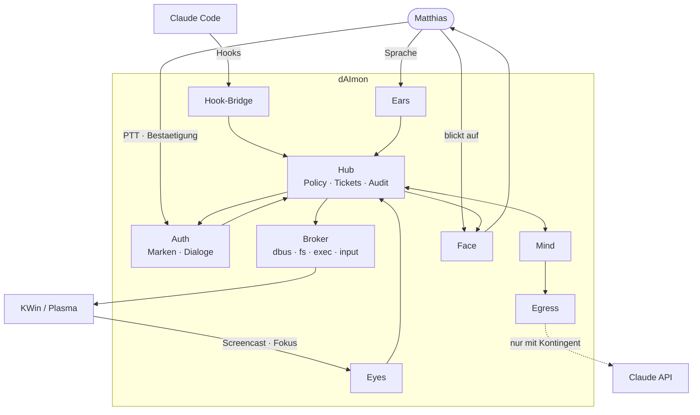
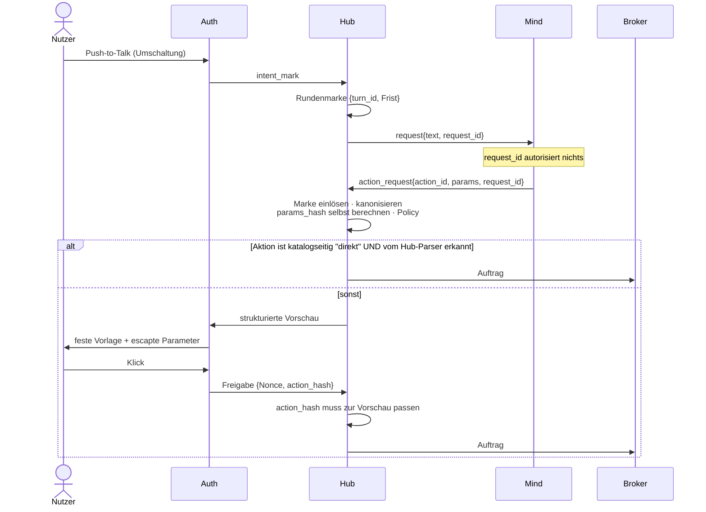
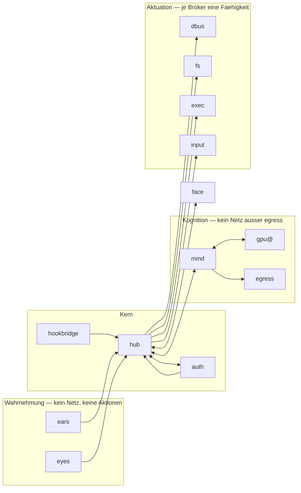
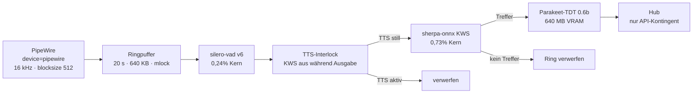
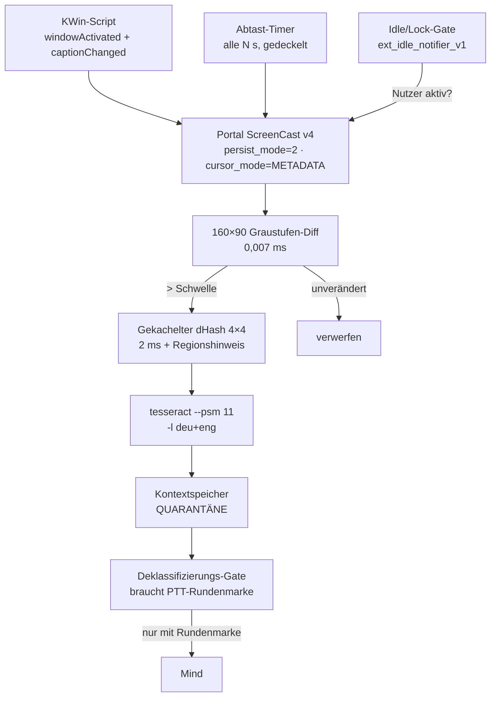
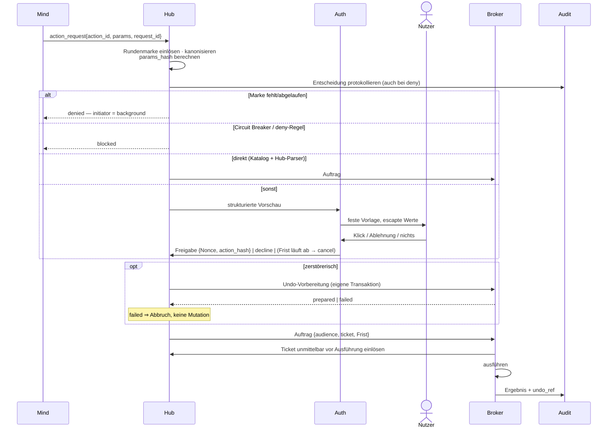
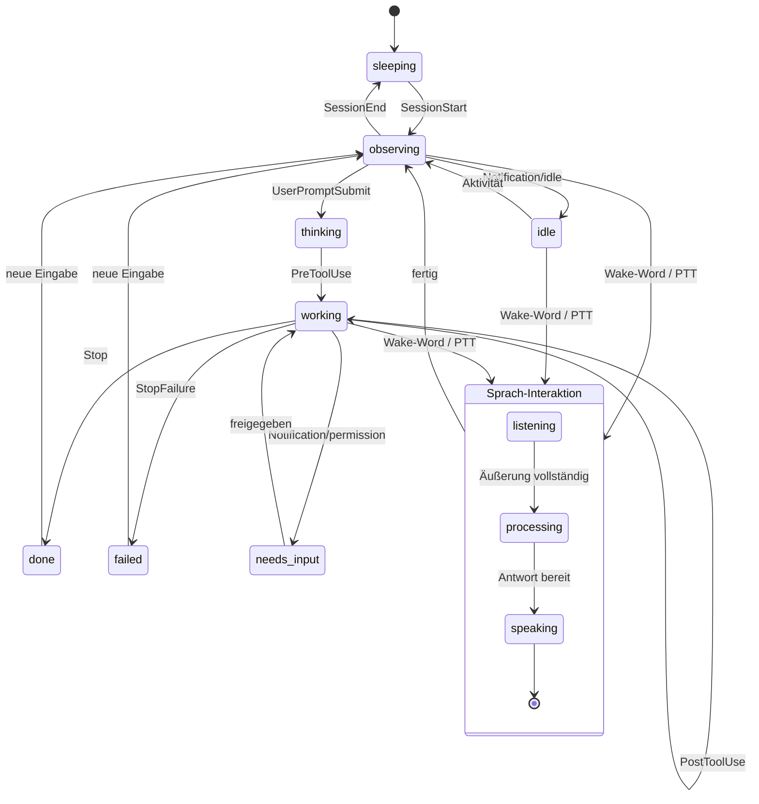

# dAImon — Design-Dokument

**Version:** 5.4 — NVIDIA-Sprachstack als zweiter Pfad (Review Runden 1–5; Nacharbeit, Prior-Art-Einarbeitung und alles ab v5.x ungeprüft)
**Datum:** 2026-07-28
**Repo:** `/home/itiger013/Dokumente/Github/dAImon`
**Zielsystem:** CachyOS (Arch), Kernel 7.1.5, KDE Plasma 6.7.3 / KWin 6.7.3 auf Wayland, RTX 5090 (32 GB, Treiber 610.43.02, sm_120), 24 Threads, 30 GB RAM, `/home` auf btrfs, PipeWire 1.6.8, fish-Shell.

Alle mit **[V]** markierten Aussagen wurden auf genau dieser Maschine verifiziert. **[U]** markiert Unverifiziertes.

> **§1.3 zuerst lesen.** Ohne das Bedrohungsmodell klingt jede folgende Zusage stärker, als sie ist.
>
> v3.0 ist eine vollständige Neufassung, keine Flickenversion. v2.1 hatte das Bedrohungsmodell vorangestellt, aber die abhängigen Abschnitte nicht nachgezogen — sie beschrieben weiter die abgelöste Mechanik. Änderungsprotokoll in §16.

---

## 1. Zielbild

dAImon ist ein Desktop-Familiar: eine kleine, dauerhaft sichtbare Figur am Bildschirmrand, die

1. **anzeigt**, was die laufenden Claude-Code-Sessions gerade tun,
2. **zuhört** und antwortet, wenn sie angesprochen wird,
3. **mitliest**, was auf dem Bildschirm passiert, um Fragen im Kontext zu beantworten,
4. **auf ausdrückliche Anforderung den PC steuert**, beschränkt auf eine geprüfte Whitelist,
5. **mitschneidet**, was auf dem Bildschirm passiert und was gesprochen wird, damit später danach gesucht werden kann,
6. **einen Charakter hat**, der in einer Datei definiert ist.

Der Nutzwert steht und fällt mit Punkt 1: am Rand des Blickfelds zu sehen, dass ein Agent auf eine Freigabe wartet, ohne ins Terminal zu schauen.

### 1.1 Nicht-Ziele

| Nicht-Ziel | Begründung |
|---|---|

| Cloud-Verarbeitung des Mitschnitts ohne Nutzerauslösung | Netzsperre **und** Deklassifizierungs-Gate (§7.2). Das Archiv liegt lokal und wird nur auf Nachfrage durchsucht |
| Automatisches Durchsuchen des Archivs durch das Modell | Ausdrücklich abgewählt. Proaktives Verhalten sieht die Historie nicht — sonst wäre die Injektionsfläche die gesamte aufgezeichnete Vergangenheit statt des aktuellen Bildschirms |
| Freie Maus-/Tastatursteuerung im Computer-Use-Stil | Synthetische Eingabe ist unklassifizierbar (§6.7) |
| Multi-User, Fernsteuerung | Ein Rechner, ein Nutzer |
| Plattformportabilität | Linux/Wayland/KDE |
| Cursor-verfolgendes Verhalten | Globale Zeigerposition auf Wayland per Design nicht abfragbar **[V]** |
| Persistenz des Session-Status über Neustarts | Ein Live-Status, der Totes anzeigt, lügt |
| Erkennung, ob ein Passwortfeld fokussiert ist | Aus Wayland-Fenstermetadaten nicht ermittelbar |
| Sprachbefehle als Autorisierung | Audio ist nicht authentifizierbar (§4.6) |
| **Abwehr eines Angreifers mit Codeausführung unter derselben uid** | Nicht leistbar (§1.3) |

### 1.2 Dauermitschnitt

Ausdrücklich gewollt: dAImon schneidet den **Bildschirm** durchgehend mit, damit später gesucht werden kann. Das kehrt eine Entscheidung aus v1.0 um und zieht Folgen nach sich, die hier stehen, damit sie nicht später überraschen.

> **Berichtigt am 14.08. (T-7.4).** Hier stand „Bildschirm **und Ton** durchgehend". Das widersprach §1.1 und T-3.15, und zwar nicht in der Auslegung, sondern im Mechanismus: dort gilt *kein Mikrofon ohne Push-to-Talk* — nicht „wir verwerfen, was ohne PTT hereinkommt", sondern **es kommt nichts herein**; ohne `voice.listening` existiert im Ohren-Dienst kein `Aufnahme`-Objekt.
>
> Aufgelöst **zugunsten von §1.1**, weil sie die ältere und die schärfere Zusage ist. Archiviert werden deshalb **nur Transkripte von PTT-Abschnitten** — von dem also, was der Nutzer ohnehin gesprochen und transkribiert hat. Das ist **kein Dauermitschnitt des Tons**, und der Unterschied ist der ganze Punkt: §201 StGB entschärft sich, weil der Nutzer die Taste hält, statt dass ein Rechner im Raum mithört.
>
> Wer den Ton wörtlich durchgehend will, ändert **zuerst §1.1** — und beantwortet dabei §201. Begründung, verworfene Alternativen und Kosten: `~/Dokumente/UMBRA-Notes/DDs/dAImon/Phase-7-Tonmitschnitt-Entscheidung.md`.

**Umfang und Aufbewahrung**

| Was | Wie lange | Wo |
|---|---|---|
| OCR-Text, Fenstertitel, Zeitstempel | **30 Tage** | SQLite mit Volltextindex |
| Transkript gesprochener Abschnitte **unter Push-to-Talk** | **30 Tage** | dieselbe Datenbank |
| Frames als JPEG | **48 Stunden**, danach nur noch der Text | Verzeichnis unter `$XDG_DATA_HOME` |
| Rohaudio | **gar nicht** — nur das Transkript überlebt den Abschnitt | — |

Ein Aufräumer läuft stündlich. Zusätzlich eine harte Obergrenze in Gigabyte mit Verdrängung der ältesten Einträge, damit eine volle Platte kein Betriebszustand wird.

**Der Ton ist der heikle Teil, und zwar nicht technisch.**

Ein Bildschirmmitschnitt erfasst überwiegend eigenes Tun. Ein Tonmitschnitt erfasst **Dritte** — Gesprächspartner in Videokonferenzen, Menschen im Raum, Anrufe. In Deutschland ist die Aufnahme des nichtöffentlich gesprochenen Worts ohne Einwilligung nach **§201 StGB** strafbar, und zwar unabhängig davon, wem der Rechner gehört. Das ist keine Frage der Repository-Lizenz.

Daraus folgen drei Dinge, die nicht optional sind:

1. **Ein Pausenschalter, der zuverlässig ist.** Globaler Hotkey, plus **automatische Pause**, sobald eine Konferenzanwendung den Fokus hat oder ein Mikrofonstream einer fremden Anwendung aktiv ist. Die Liste ist konfigurierbar und standardmäßig gefüllt.
2. **Die Pause pausiert den Ton, nicht nur die Transkription.** Wie in §4.2: Der Capture-Stream wird geschlossen, nicht stummgeschaltet — sonst lügt das Plasma-Mikrofonsymbol.
3. **Sichtbarkeit.** Solange der Tonmitschnitt läuft, zeigt das Pet es an. Nicht in einem Einstellungsdialog, sondern am Sprite.

**Die Datenbank ist eine neue Angriffsfläche.** Bisher war der beobachtete Kontext auf die letzten Fenster begrenzt und flüchtig. Jetzt liegt dreißig Tage durchsuchbarer Text auf der Platte. Konsequenzen:

- Der gesamte Archivinhalt ist **`tainted`** (§5.2). Ein Suchtreffer ist kein vertrauenswürdiger Text, nur weil er aus der eigenen Datenbank kommt — er stammt ursprünglich vom Bildschirm.
- Suchtreffer gehen durch **dasselbe Deklassifizierungs-Gate** wie Live-Kontext: nur unter frischer Rundenmarke, nur mit erkennbarem Bezug, und nur der Treffer, nicht die Umgebung.
- Die Redaktionsliste läuft **vor dem Schreiben**, nicht als Nachbearbeitung. Screenpipe redigiert im Hintergrund und lässt Rohdaten zuerst auf die Platte — das ist die falsche Reihenfolge.
- Verzeichnis 0700, Datenbank 0600. Ein Angreifer mit derselben uid liest sie trotzdem (§1.3) — das ist der Preis, und er steht hier, statt beschönigt zu werden.

**Anwendungs-Denylist.** Passwortmanager, Banking, und was der Nutzer ergänzt, werden **gar nicht erst erfasst** — die Prüfung sitzt vor dem Diff und vor dem Schreiben. Dazu die DRM-Prüfung aus §4.4.

**Ein zeitlich begrenzter Privatmodus** setzt alles auf `transient` und schreibt nichts.

---

## 1.3 Bedrohungsmodell

### Im Umfang

| Bedrohung | Warum sie real ist |
|---|---|
| **Injizierte Anweisungen in beobachtetem Inhalt** | Bildschirmtext, Fenstertitel, **Hook-Nutzlasten**, Webseiten und Dateiinhalte fließen in den Modellkontext. Hauptangriffsweg. |
| **Gefälschtes Audio** | Lautsprecher, Videos, Spiele und die eigene TTS können Wake-Word und Befehle aussprechen. Kein Signalmerkmal trennt Nutzer von Lautsprecher. |
| **Modellfehler** | Halluzinierte zerstörerische Aktion ohne jeden Angreifer. Wahrscheinlicher als jeder Angriff. |
| **Versehentliche Preisgabe** | Passiv Wahrgenommenes verlässt ungewollt den Rechner. |

### Außerhalb des Umfangs

> **Ein Angreifer, der bereits beliebigen Code unter dieser uid ausführt, wird nicht abgewehrt — und kann es nicht werden.**

Ein solcher Prozess kann andere per `ptrace` lesen, `systemd --user` steuern, jede 0600-Datei öffnen, `kglobalaccel.invokeShortcut` aufrufen (und damit das „Push-to-Talk"-Ereignis erzeugen) sowie Konfiguration und Aktionskatalog überschreiben. Gegen ihn helfen weder Unit-Namen noch Dateimodi noch Signaturen.

### Sprachregelung

Diese Begriffe werden im ganzen Dokument einheitlich verwendet:

| Begriff | Bedeutung | **Nicht** gemeint |
|---|---|---|
| **Absichtsmarke** | Der Auth-Agent hat eine Nutzerhandlung gemeldet | Beweis, dass ein Mensch handelte |
| **Vertrauenswürdiger Komponentenpfad** | Modellausgabe fließt hier nicht ein | Angreifer kann hier nicht hinein |
| **Peer-Prüfung** (`SO_PEERPIDFD`) | Wegweiser zwischen eigenen Komponenten; fängt Verwechslung und Fehlkonfiguration | Authentifizierung; schließt keinen same-uid-Angreifer aus |
| **Ticket** | Einmaligkeit und Frist | Kryptografischer Herkunftsbeweis |

Wo v2.0 „unfälschbar", „physisch" oder „beweist" schrieb, steht jetzt einer dieser Begriffe.

### Was die Prozessgrenzen leisten

| Sie leisten | Sie leisten nicht |
|---|---|
| Begrenzen den Schaden aus **kompromittierter Modellausgabe** | Schutz gegen lokalen Codeausführungs-Angreifer |
| Machen Fähigkeiten aufzählbar und prüfbar | Integritätsdurchsetzung zwischen Peers |
| Erzwingen **kein Netz** für Wahrnehmung (Kernelgrenze) | Verhindern, dass ein anderer Prozess dieselbe Wirkung erzielt |
| Granulare, von außen prüfbare Kill-Switches | Beweisen, dass eine Handlung vom Menschen kam |

**Konsequenz:** Signaturen zwischen eigenen Prozessen wären Zeremonie — der Schlüssel ist für den ausgeschlossenen Angreifer ohnehin lesbar, und der ehrliche Fall läuft bereits über einen direkten Socket. Es gibt keine (§6.2).

### Die vertrauenswürdige Basis

Nicht alle Komponenten sind gleich kritisch. Der **Hub ist die zentrale vertrauenswürdige Komponente**: Er hält Policy, Absichtsmarken, Tickets, das Deklassifizierungs-Gate, die Referenztabelle und die Audit-Koordination. Fällt er, fällt alles.

> **Einwand, der ernst zu nehmen ist:** Wenn derselbe Prozess Modellausgabe **auswertet** und die Policy hält, liegt die Policy im Wirkungsradius. Die Broker schützen dann die falsche Sache. Hermes' `SECURITY.md` sagt es unverblümt: Die einzige echte Grenze gegen bösartige Modellausgabe ist das Betriebssystem; kein prozessinternes Gatter, kein Filter und keine Allowlist ist Eindämmung.
>
> **Konsequenz: Auswertung und Policy sind getrennt.** Das Zerlegen einer Modellantwort — JSON schälen, Felder ziehen, Referenzen auflösen — passiert in `daimon-mind`. Der Hub bekommt eine bereits strukturierte, schema-validierte Nachricht und **liest nie freien Modelltext**. Er kennt Aktions-IDs aus dem Katalog, Zahlen in geprüften Bereichen und opake Referenzen aus der eigenen Tabelle. Was ihn erreicht, hat schon eine Prozessgrenze passiert.

Er wird deshalb bewusst klein gehalten und behandelt **jede** Eingabe als unvertrauenswürdig — auch von eigenen Komponenten:

- Jede Nachricht wird gegen ein Schema validiert, bevor ein Feld gelesen wird.
- Feldlängen und Verschachtelungstiefen sind gedeckelt.
- Unbekannte Felder werden verworfen, nicht durchgereicht.
- Ein Fehler in einer Nachricht beendet die Verbindung, nicht den Hub.
- Der Hub ruft nie in Modell-, Netzwerk- oder Renderingcode.

---

## 2. Architektur

### 2.1 Dienstverzeichnis

Kanonisch. Jede Zählung und jedes Diagramm leitet sich hieraus ab: **vierzehn eigene Dienste** plus ein KWin-Script und einen im GPU-Worker gestarteten Hilfsprozess.

| # | Unit | Alleinige Fähigkeit | Netz | Grenze entfernt welche Fähigkeit |
|---|---|---|---|---|
| 1 | `daimon-hub` | Policy, Marken, Tickets, Audit | nein | — (vertrauenswürdige Basis, §1.2) |
| 2 | `daimon-hookbridge` | einziger TCP-Socket | Loopback-Listen | Isoliert den einzigen netzwerkerreichbaren Punkt |
| 3 | `daimon-auth` | Absichtsmarken, Bestätigungsdialoge | nein | Rendert nie freien Modelltext (§2.4) |
| 4 | `daimon-ears` | Mikrofon | nein | Kill-Switch, Netzsperre |
| 5 | `daimon-eyes` | Screencast-Session | nein | Kill-Switch, Netzsperre |
| 6 | `daimon-mind` | Prompt-Aufbau, Persona, Gedächtnis | **nein** | Hält keinen Token, kann nicht selbst senden |
| 7 | `daimon-egress` | **einzige ausgehende HTTPS-Verbindung**, API-Token | ja | Setzt Domain und Kontingent durch, statt es Mind zu überlassen |
| 8 | `daimon-gpu@<typ>` | GPU-Speicher | nein | Template-Unit, selbstbeendend |
| 9 | `daimon-dbus` | DBus-Aufrufe, argumentvalidiert | nein | Andere Fähigkeit als Dateien |
| 10 | `daimon-fs` | Dateisystem-Schreibzugriff | nein | Braucht Schreibrechte, die sonst niemand hat |
| 11 | `daimon-exec` | App-Start | nein | Startet fremden Code |
| 12 | `daimon-input` | `/dev/uinput` bzw. libei | nein | Gefährlichste Fähigkeit, one-shot |
| 13 | `daimon-face` | Wayland-Surface, Audioausgabe | nein | Rendert Modelltext, erteilt daher keine Freigaben |
| 14 | `daimon-recorder` | **Schreibzugriff aufs Archiv**, Aufräumer | nein | Einziger Prozess, der dauerhaft auf Platte schreibt; getrennt von `eyes`, damit die Live-Wahrnehmung lesend bleibt |

Vierzehn Zeilen, vierzehn Dienste. Dazu: KWin-Script `daimon-watcher` (läuft im Compositor, read-only), `xdg-dbus-proxy` (in `daimon-dbus`), `llama-server` (im GPU-Worker-Prozessbaum, §5.4).

Zusammengelegt wurde, wo keine Grenze entsteht: alle GPU-Modelltypen teilen eine Template-Unit und einen Worker-Code — gleiche Fähigkeit, gleiche Vertrauensstufe.

### 2.2 Systemkontext



Drei Trennungen tragen die Argumentation:

- **Auth ist nicht Face.** Face rendert Modelltext und erteilt deshalb keine Freigaben. Auth erteilt Freigaben und rendert nur strukturierte Vorlagen (§2.4).
- **Mind ist nicht Egress.** Mind baut Prompts, hat aber weder Token noch `AF_INET`. Egress transportiert, kennt eine Domain und verlangt je Anfrage ein Kontingent.
- **Der Hub hat keinen TCP-Socket.** Der einzige Port liegt in der Hook-Bridge.

### 2.3 Kernregel

> **Passiver Kontext kann keine Aktion ausloesen und keinen Dialog oeffnen.**
> Eine Aktion entsteht nur aus einer Aeusserung mit Markierung `user_ptt` unter gueltiger Rundenmarke.

Beobachteter Bildschirmtext, Hook-Events und Hintergrundschleifen koennen eine **Empfehlung im Face anzeigen** — eine Sprechblase, die der Nutzer lesen und ignorieren kann. Sie koennen **den Auth-Agenten nicht oeffnen**. Koennten sie es, waere Dialog-Flut ein Angriffsweg, und ein zermuerbter Nutzer klickt irgendwann. Deshalb verlangen T-5.11 und T-6.7b **null** Auth-Dialoge aus passivem Inhalt.

### 2.4 Absichtsmarken und Bestätigung

| Auslöser | Erteilt | Reicht für |
|---|---|---|
| Push-to-Talk im Auth-Agenten (Umschaltung) | **Rundenmarke** | einen API-Aufruf, Kontextfreigabe, das *Vorschlagen* einer Aktion |
| Klick auf „Ausführen" im Aktionsdialog | **Aktionsfreigabe**, an die kanonisierte Aktion gebunden | genau diese Ausführung |
| Wake-Word | **API-Kontingent** | einen API-Aufruf und eine gesprochene Antwort. Sonst nichts. |

Das **API-Kontingent autorisiert nichts** und deklassifiziert nichts. Sonst genügte ein Video, das den Namen und „was steht auf meinem Bildschirm?" sagt, um den Bildschirm in die Cloud zu schicken.

**Keine ambiente Vollmacht.** Ein Tastendruck belegt, dass der Nutzer *etwas* wollte, nicht *was*. Die Freigabe ist deshalb an die kanonisierte Aktion gebunden.



**Die Ausnahme für Direktbefehle ist Hub-Eigentum, nicht Modell-Eigentum.** Sie greift nur, wenn beides gilt: Der Aktionskatalog markiert die Aktion als `direct: true` (nur nebenwirkungsarme, wertbeschränkte Aktionen — Lautstärke, Medien, Fensterfokus), **und** ein deterministischer Parser im Hub hat sie aus der Äußerung selbst erkannt. Kommt die Aktion aus einer Modellausgabe, geht sie **immer** durch die Vorschau — unabhängig davon, was das Modell behauptet.

**Die Vorschau ist eine Senke für markiertes Material** und wird in §5.2 als solche geführt. Der Auth-Agent kann nicht gleichzeitig „nie Modelltext zeigen" und eine sinnvolle Bestätigung leisten — die Bestätigung muss den Zielpfad zeigen. Auflösung: eine **feste Vorlage mit festen Beschriftungen**, in die Parameterwerte **escapt, längenbegrenzt und sichtbar in Anführungszeichen** eingesetzt werden. Kein freier Fliesstext, keine Modellformulierung, keine Auszeichnungssprache.

Ein Verbot von Steuerzeichen reicht nicht. Werte werden **Unicode-normalisiert** (NFC), und alles, was die Darstellung verfaelschen kann, wird **sichtbar escapt** statt gerendert: Bidi-Overrides (U+202A-U+202E, U+2066-U+2069), Nullbreiten- und Formatzeichen (U+200B-U+200F, U+FEFF), Zeilen- und Absatztrenner, ANSI-Sequenzen. Verwechselbare Glyphen in Pfaden werden markiert. Ein Zielpfad, der wie `~/Bilder/urlaub.png` aussieht, aber `~/.ssh/id_ed25519` ist, machte die Bestaetigung sonst wertlos.

```
Ember will ausführen:
  Aktion:  Datei in den Papierkorb verschieben
  Ziel:    "/home/itiger013/Dokumente/notiz.txt"
  Umkehr:  möglich (Papierkorb)
[Ausführen]  [Ablehnen]
```

Die Marke bleibt im Hub; Mind bekommt nur eine `request_id`. `params_hash` berechnet der Hub nach eigener Kanonisierung.

**Push-to-Talk ist eine Umschaltung**, kein Halten — `kglobalaccel` liefert keine verlässlichen Loslass-Ereignisse. Zeitlimit als Rückfall.

### 2.5 Gestenfenster für Aktionen mit großer Sprengweite

Für die gefährlichsten Fähigkeiten reicht eine gültige Rundenmarke nicht. Sie gelten für die ganze Runde, und eine Runde kann lang sein.

`openpets` löst das mit einem Tiefenzähler, der nur innerhalb eines nutzerausgelösten Kommandos hochgezählt ist und zwei Sekunden nach dessen Ende zurückfällt — Clipboard-Lesen ist dort *erteilt und trotzdem* nur in diesem Fenster benutzbar. Übernommen für:

| Fähigkeit | Fenster |
|---|---|
| `clipboard.read` | 2 s nach der bestätigenden Nutzerhandlung |
| Bildschirm-Deklassifizierung (§7.2b) | 2 s |
| `input.type` | 2 s, zusätzlich zur ohnehin nötigen Einzelfreigabe |

Zwei unabhängige Bedingungen: die Fähigkeit muss erteilt **und** das Fenster offen sein. Eine Aktion, die drei Minuten nach dem Tastendruck ausgelöst wird, ist keine Reaktion auf ihn.

---

## 3. Vertrauensgruppen



Regel: Kein Prozess hat gleichzeitig Netz und Systemzugriff, und jeder Broker hat genau eine Fähigkeit.

Nicht gebaut: kein Message-Broker, keine Plugin-API, keine Abstraktionsschicht über DBus, keine Datenbank vor Phase 6.

---

## 4. Wahrnehmung

### 4.1 Gehör



**Zwei Tonpfade, verschiedene Zwecke.**

```
Mikrofon (ein Stream)
  ├─ Ansprache-Pfad  → VAD → Rückkopplungssperre → Wake-Word → STT → Anfrage
  └─ Archiv-Pfad     → VAD → STT nur der Sprachabschnitte → SQLite (30 Tage)
```

Der Archiv-Pfad transkribiert **nur erkannte Sprachabschnitte**, nicht die Stille dazwischen — sonst liefe das Rechenwerk durchgehend. Der STT-Dienst **residiert**: er beendet sich bei Stille nicht.

> **Korrektur vom 19.08.** Hier stand „bei Stille beendet er sich wie gehabt",
> und in `daimon/gpu/stt.py:24` steht seit jeher ein Abschnitt „Kein
> Leerlauf-Exit". Zwei Fassungen einer Regel sind eine Regel und eine
> Attrappe; welche gilt, entschied der Zufall dessen, der zuerst nachschlug
> (Befund T-7.4 K3, Reviewer-Sitzung).
>
> Es gilt die Residenz, und der Grund ist gemessen: das Modell liegt auf der
> **CPU und belegt 0 VRAM** (`stt.py:1`, `provider="cpu"` im Code und nicht in
> der Konfiguration — sonst ließe sich die Zusage per Datei aushebeln). Es
> gibt also nichts zurückzugeben, was §5.4 zurückfordern könnte, und ein
> Neustart kostet 843 ms Ladezeit. Das Modell im Speicher **ist** die
> Latenzzusage.
>
> Socket-aktiviert bleibt der Dienst trotzdem: gestartet wird er beim ersten
> Wort, nicht beim Anmelden.

**Rohaudio überlebt den Abschnitt nicht.** Nur das Transkript wird geschrieben. Der Ringpuffer bleibt, was er war: 20 Sekunden im Arbeitsspeicher, `mlock`, nie auf Platte.

Beide Pfade hängen am selben Stream und werden vom Pausenschalter aus §1.2 **gemeinsam** abgeschaltet — durch Schließen des Streams, nicht durch ein Flag (§4.2).

Gemessen **[V]**:

| Stufe | CPU (ein Kern) | RAM | VRAM |
|---|---|---|---|
| silero-vad ONNX, 1 Thread | 0,24 % | geteilt | 0 |
| sherpa-onnx KWS zipformer-3.3M int8 | 0,73 % | 86 MB | 0 |
| PipeWire-Callback @ 32 ms | ~0,15 % **[U]** | ~10 MB | 0 |

**Wake-Word ohne Training.** sherpa-onnx nimmt Keywords als Textdatei entgegen:

```bash
printf 'HEY DAIMON\nOKAY EMBER\n' > raw.txt
sherpa-onnx-cli text2token --tokens $D/tokens.txt --tokens-type bpe \
    --bpe-model $D/bpe.model raw.txt custom_kw.txt
```

Verifiziert **[V]**: 0,047 s CPU für 6,6 s Audio, Erkennung funktioniert auf den Testdateien.

> **Größtes offenes Risiko:** Es gibt **kein deutsches KWS-Modell**. Der englische BPE-Tokenizer nähert einen deutsch klingenden Namen an, aber die Robustheit bei deutscher Aussprache ist **[U]**. Wird in Phase −1 gemessen, bevor irgendetwas anderes gebaut wird. Plan B: `livekit-wakeword` (Apache-2.0) trainiert deutsch und exportiert kompatibel. Plan C: nur Push-to-Talk.

**Transkription:** `onnx-asr` + `nemo-parakeet-tdt-0.6b-v3`, int8, 640 MB VRAM, deutsche WER 3,64.

> **Erste eigene Zahlen [V], 2026-07-28.** Beim Anlegen von T−1.12 lief der Pfad
> auf dieser Maschine durch: `onnx-asr` 0.12.0 auf `onnxruntime-gpu` 1.27.0,
> `CUDAExecutionProvider`, fp32. p95 **28 ms** für eine 3,6-s-Äußerung gegen
> **684 ms** bei sherpa-Whisper-small auf CPU, WER 0,103 gegen 0,178.
>
> **Das ist ein Smoke-Test, kein Ergebnis:** n = 2–3, Testaudio synthetisch
> (mit sherpa-VITS erzeugt, also sauberer als jedes Mikrofon), und der
> Verifizierer T−1.12.v existiert noch nicht. Die WER-Zahlen sind untereinander
> vergleichbar, absolut sind sie wertlos. Belastbares kommt aus
> `spikes/nvidia-voice/results.json`; der Vorbefund liegt in `smoke.json`.
>
> Ein Nebenbefund ist trotzdem endgültig: **`canary-180m-flash` ist in `onnx-asr`
> 0.12.0 nicht enthalten**, obwohl es auf HF liegt. Verfügbar sind nur
> `nemo-parakeet-tdt-0.6b-v3` und `nemo-canary-1b-v2`. Der 180m-Weg bräuchte
> NeMo — also Torch, für ein Modell, das lediglich schneller wäre. Fällt aus.
>
> Der VRAM-Wert von 640 MB stammt aus der Recherche und ist damit **nicht**
> bestätigt: gemessen wurden ~5,9 GB, allerdings fp32 und als Gesamtbelegung der
> GPU inklusive Desktop. Die int8-Zahl steht weiter aus.

> **Offener Blocker, den der Review aufgedeckt hat:** Arch' `onnxruntime-opt-cuda 1.27.1` ist zwar mit `120-real` gegen CUDA 13.3 gebaut **[V]** — aber das Paket enthält **keine Python-Bindings** (46 Dateien, nur `.so`) **[V]**. Ein `uv`-venv mit Python 3.12 kommt an diese Cubins also nicht ohne Weiteres heran, und `pip install onnxruntime-gpu` bringt möglicherweise keine sm_120-Kernel mit. Das muss in Phase −1 geklärt werden, sonst bricht die gesamte STT-Begründung zusammen. Ausweg, falls der Import scheitert: ein Worker außerhalb des venv gegen die C-API, oder whisper.cpp-CUDA aus dem AUR (`-DCMAKE_CUDA_ARCHITECTURES=native` erkennt sm_120 korrekt).

Verworfen bleibt faster-whisper: CTranslate2 unterstützt CUDA 13 nicht (Issue #1933 offen), und die PyPI-Wheels enthalten wegen eines Regex-Fehlers in CMakes `select_compute_arch.cmake` keine Blackwell-Cubins — `get_cuda_device_count()` liefert 0. Die AUR-Variante hat CUDA gar nicht in den makedepends **[V]**.

### 4.2 Mikrofon-Kill-Switch — eine Korrektheitsanforderung

Aus dem Quelltext von `plasma-pa` verifiziert **[V]**: Das Mikrofonsymbol in der Plasma-Leiste hängt **allein** an der Existenz eines nicht-virtuellen PulseAudio-Source-Outputs. Es prüft weder den PipeWire-Node-Zustand noch `corked`.

> Damit das Symbol verschwindet, muss der Capture-Stream **zerstört** werden. `stream.stop()` reicht nicht, `pw_stream_set_active(false)` reicht nicht. Es braucht `stream.close()` bzw. `pw_stream_disconnect()`.

„Zuhören an/aus" ist also eine harte Lebenszyklusgrenze, kein Flag in der Callback. Stream auf beim Einschalten, zu beim Ausschalten — **niemals pro Äußerung**.

Es gibt in 2026 immer noch **kein Mikrofon-Portal** in xdg-desktop-portal **[V]**; eine native App spricht direkt mit PipeWire. Das Plasma-Symbol ist damit das einzige Privacy-Signal, das der Nutzer bekommt.

### 4.3 Rückkopplungssperre

Die eigene Sprachausgabe darf nicht als Nutzereingabe zurückkommen. Sonst kann injizierter Text, den das Pet vorliest, sich selbst als neuer Sprachbefehl reaktivieren.

- KWS und STT sind gesperrt, solange TTS spielt, **plus 500 ms Nachlauf**.
- Zusätzlich Echo-Referenz: Der TTS-Ausgabepuffer wird als Referenzsignal geführt; erkennt der Vergleich das eigene Signal, wird das Segment verworfen.
- Die Sperre gilt auch bei Push-to-Talk — sonst wäre sie umgehbar, indem der Nutzer währenddessen drückt.

### 4.4 Sehen



Zwei Änderungen gegenüber v1.0:

**Ein Abtast-Timer neben dem Fokus-Ereignis.** Fensterwechsel allein verpasst alles, was sich *innerhalb* des fokussierten Fensters ändert — Terminalausgabe, ein ladender Build, ein Dialog, ein Video. Der Timer läuft mit niedriger, gedeckelter Rate zusätzlich zum Ereignis.

**Der Kontextspeicher steht unter Quarantäne.** OCR-Text erreicht Mind nicht automatisch, sondern nur durch das Deklassifizierungs-Gate (§7.2).

> **Korrektur gegenüber v3.4 — das gekachelte dHash-Verfahren fällt weg.** Screenpipe hat genau diesen Ansatz gebaut und wieder verworfen, und begründet es im Quelltext: *„region-scoped pixel hashing … produced wrong skips … region-scoped hashes missed anything the region detector didn't box"*, und eine vorgeschaltete Stabilitätsbestätigung *„starved continuously-changing surfaces outright"*.
>
> Die Rechnung stimmt: Ein 4×4-Raster über einen 160×90-Puffer ergibt Kacheln von 40×22 Pixeln. Auf 1440p deckt eine Kachel rund 640×360 echte Pixel ab. Eine geänderte Textzeile ist darin eine Störung unter einem Prozent und kippt oft **kein einziges Bit**. Wir hätten still Inhalte verpasst — der schlimmste Fehlermodus, weil er sich nicht meldet.

**Die Kette, auf die screenpipe nach zwei Fehlversuchen konvergiert ist:**

```
Fokus-Ereignis / Abtast-Timer
  → Anwendungs-Denylist  (Passwortmanager, Banking — vor allem anderen)
  → DRM-Inhalt fokussiert?  → überspringen
  → Idle-/Lock-Gate
  → auf das fokussierte Fenster zuschneiden
  → Textregionen erkennen        ~10–19 ms
  → auf die Vereinigung der Regionen zuschneiden (gepolstert)
  → Signatur über diesen Zuschnitt, Luma auf 32 Stufen quantisiert   1–3 ms
  → unverändert? verwerfen
  → OCR auf dem Zuschnitt        Hunderte von ms
```

> **Korrektur aus Spike T−1.10 [V] — der Regionen-Zuschnitt bringt nichts.**
>
> Die Vereinigung der erkannten Textregionen deckt auf einem Vollbild **97 % (dicht) bis 99 % (spärlich)** der Fläche ab. Darauf zuzuschneiden ist ein No-Op. Screenpipes Gewinn kam nicht daher, sondern aus dem **Zuschnitt auf das fokussierte Fenster** plus der Signatur.
>
> Die Einzelboxen decken nur 9–10 % der Fläche ab — sie einzeln zu erkennen wäre ein echter Gewinn, aber dann dominiert der Aufrufaufwand von 60 ms je Aufruf. Ob sich das lohnt, hängt an der Zahl der Boxen und ist erst mit echten Bildschirmen zu entscheiden.
>
> **Der Zuschnitt aufs fokussierte Fenster bleibt der Gewinn.** Ein 600×300-Ausschnitt kostet 277–350 ms statt 3300–4200 ms für das Vollbild.

**Der Zuschnitt aufs fokussierte Fenster ist der Durchsatzgewinn, nicht die Kachelung und nicht der Regionen-Zuschnitt.** Signatur über den *ganzen* Zuschnitt in voller Auflösung, `px >> 3` — rauschtolerant, aber empfindlich für Textänderungen. Heuristikfrei, weil jede Heuristik hier zu stillen Auslassungen führte.

Textregionen-Erkennung als Portierung einer OpenCV-Sequenz, ohne die OpenCV-Abhängigkeit: BT.601-Graustufen → 3×3-Morphologiegradient → Otsu → 9×1-Schließung → Zusammenhangskomponenten → Formfilter (`MIN_BOX_W=8`, `MIN_BOX_H=6`, Seitenverhältnis 1–40, `MAX_AREA_FRACTION=0.5`).

Gemessene Kosten **[V]** (unsere Maschine) und **[U]** (screenpipe, andere Hardware):

| Prüfung | Kosten |
|---|---|
| Fensterwechsel-Ereignis | ≈0 — filtert über 90 % aller Frames |
| Idle-/Lock-Gate, Denylist | ≈0, und zugleich privacy-korrekt |
| Textregionen-Erkennung | ~10–19 ms **[U]** |
| Signatur über den Zuschnitt | 1–3 ms **[U]** |
| tesseract, spärlicher Text | 0,095 s **[V]** |
| tesseract, dichter Text | **2,86 s [V]** — screenpipe misst 0,4–1,4 s **[U]** |

> **Die eigentliche Lehre aus den Zahlen:** OCR ist zwei Größenordnungen teurer als alles davor. **Die Aufgabe des Gatters ist nicht, OCR billig zu machen, sondern selten.** Und: screenpipe nutzt auf macOS Apple Vision, auf Windows Windows.Media.Ocr und greift **nur auf Linux** zu tesseract — es ist dort niemandes erste Wahl, sondern der Rückfall.
>
> **Gemessen in T−1.10 [V]**, auf dieser Maschine, 5120×1440 (7,4 MP), n=20, `OMP_NUM_THREADS=1`:
>
> | Variante | dicht | spärlich | Ausschnitt 600×300 |
> |---|---|---|---|
> | CLI-Unterprozess | 3725 ms | 4236 ms | 338 ms |
> | libtesseract per FFI | 4063 ms | 4727 ms | 338 ms |
> | **dauerhafter Arbeitsprozess** | **3273 ms** | **4084 ms** | 352 ms |
> | VLM (gemma4:26b) | 23 040 ms → **0 Zeichen** | 22 993 ms → **0 Zeichen** | 15 221 ms |
>
> Alle tesseract-Varianten liefern byteidentische Zeichenzahlen — der Vergleich ist fair.
>
> **Drei Befunde, die den Plan ändern:**
>
> 1. **Der Aufrufweg ist fast egal.** Der Festaufwand des CLI-Aufrufs beträgt **60 ms** — 18 % eines Ausschnitts, 1,6 % eines Vollbilds. Die CLI-zu-FFI-Umstellung ist damit 60 ms wert, keine Größenordnung. Ich hatte das überschätzt.
> 2. **Der größere Hebel ist `tessdata_fast`:** 268 statt 545 ms auf dem Ausschnitt bei gleichem Ertrag. **−277 ms** gegenüber −60 ms für den Aufrufweg.
> 3. **tesseracts OpenMP ist hier ein Verlust.** 24 Threads sind ~25 % *langsamer* als ein Thread. Und es ist ansteckend: libtesseract im selben Prozess wie numpy und OpenBLAS kostet reproduzierbar ~800 ms extra je Vollbild. **Das ist das Argument für den Arbeitsprozess statt In-Process-FFI** — nicht die Geschwindigkeit, sondern die Isolation.
>
> **Das VLM kann tesseract nicht ersetzen.** Auf dem Vollbild liefert es deterministisch **nichts** (6 von 6 Aufrufen) — das 7,4-MP-Bild wird auf ~256 Bildtoken kodiert. Zur Ausgabe gezwungen **halluziniert** es und wiederholt sich. Ein stiller Fehlermodus, schlimmer als gar keine OCR. Auf dem Ausschnitt ist es 45× langsamer, dafür genauer.
>
> **Entscheidung: tesseract bleibt, als dauerhafter Arbeitsprozess mit `tessdata_fast` und `--psm 11`, ein Thread.**

**Nebenläufigkeit:** OCR läuft in einem Pool und kann in falscher Reihenfolge fertig werden. Jeder Frame trägt eine Generationsnummer; Ergebnisse einer älteren Generation als der aktuellen werden verworfen, nicht eingetragen. Geänderte Kachelbereiche werden **kopiert**, nicht referenziert — sonst zeigt der Verweis beim Abschluss auf einen längst überschriebenen Puffer.

### 4.5 Bildschirmerfassung

`wayland-info` listet auf dieser Session 66 Globals, darunter **kein** `zwlr_screencopy_manager_v1` und **kein** `ext_image_copy_capture_manager_v1` **[V]**.

| Weg | Funktioniert | Dialog |
|---|---|---|
| Portal ScreenCast + PipeWire | **ja** — der unterstützte Weg | einmalig, mit `persist_mode=2` |
| `org.kde.KWin.ScreenShot2` | ja, mit root-installierter `.desktop` | nie |
| `grim` | **nein** — kein Protokoll vorhanden | — |
| `ext-image-copy-capture-v1` | **nein** — KDE hat abgelehnt (Bug 513785) | — |

`version = 4` **[V]** heißt: `restore_token`/`persist_mode` sind verfügbar, der Nutzer klickt genau einmal.

**Puffertyp explizit aushandeln.** Wir wollen ausdrücklich **keinen GPU-Kontext**. Liefert das Portal aber DMA-BUF-Puffer, hilft `MAP_BUFFERS` nicht — screenpipe liest nur `data.data()` und bekäme auf einer Maschine, deren Compositor DMA-BUF bevorzugt, stillschweigend nichts. Auf einer RTX 5090 ist das der wahrscheinliche Fall.

Deshalb: **SHM im `EnumFormat` explizit verlangen** und `SPA_DATA_DmaBuf` als Fehlerfall behandeln, nicht als Überraschung. Kommt trotzdem DMA-BUF, wird abgebrochen und protokolliert — ein schwarzes Bild ist schlimmer als eine Fehlermeldung.

**`CursorMode::METADATA` braucht einen Rückfall.** Der Modus muss in `AvailableCursorModes` angeboten werden. KWin tut das **[V]**, aber wenn ein künftiger Portal-Rückend ihn fallen lässt, brauchen wir `EMBEDDED` plus eine Maskierung des Zeigerbereichs vor dem Diff — sonst feuert jede Mausbewegung die Kette.

**Zwei weitere Fallen, beide leicht zu übersehen:**

1. Der `restore_token` ist **einmalig**. Jedes erfolgreiche `Start` liefert einen neuen. Wer den gespeicherten nicht überschreibt, bekommt beim zweiten Start wieder den Dialog. Ist der Token ungültig, ignoriert das Portal ihn **stillschweigend** und zeigt den Dialog — nie ohne interaktiven Fallback aufrufen.

2. **Der persistierte Token ist ein dauerhafter, stiller Bildschirmzugriffs-Ausweis** in unserem Konfigurationsverzeichnis. Nach §1.2 liegt ein Angreifer mit derselben uid außerhalb des Umfangs — aber es bleibt eine Vertrauensfrage gegenüber dem Nutzer („warum fragt es nicht mehr?"). Deshalb: Modus 0600, **ein sichtbarer Widerrufsweg im Kontextmenü**, der die Datei löscht und die Portal-Sitzung schließt, und ein Hinweis in der Dokumentation auf `flatpak permission-remove`. Screenpipe hat dieses Problem nicht, weil es den Token nie schreibt — und deshalb bei jedem Start erneut fragt.

3. **Die PipeWire-Node-ID im Stream-Tupel ist seit ScreenCast v6 veraltet.** IDs werden nach Zerstörung eines Node wiederverwendet. Wer darauf verbindet, bekommt bei Monitor-Hotplug, Auflösungswechsel oder Suspend **stillschweigend den falschen Stream** — kein Fehler, nur falsche Bilder.

> **Korrektur gegenüber v3.0.** Dort stand `path={node_id}` in der GStreamer-Pipeline. Richtig ist eine Bindung über die Eigenschaft **`pipewire-serial`** (monoton, 64 Bit, wird nie wiederverwendet) mittels `PW_KEY_TARGET_OBJECT`. Die Node-ID bleibt nur als Rückfall für Portale unter v6.

Es gibt für diesen Ablauf **keine gepflegte Bibliothek**, weder in Python noch in Rust. Die kanonische Referenz ist ein Rohskript in [xdg-desktop-portal #1371](https://github.com/flatpak/xdg-desktop-portal/issues/1371) — in dem zugleich ein Fehler dokumentiert ist, bei dem die Wiederherstellung den falschen Monitor liefert. Dafür ist echte Zeit einzuplanen.

### 4.6 Warum Sprache nicht autorisiert

Der Mikrofonkanal ist **nicht authentifizierbar**. Alles, was hörbar ist, kann das Wake-Word und einen Befehl aussprechen: ein YouTube-Video, ein Spiel, ein Anruf über Lautsprecher, ein Kollege, oder eine Webseite mit Autoplay. Es gibt kein Merkmal im Audiosignal, das „Matthias hat das gesagt" von „der Lautsprecher hat das gesagt" trennt.

Daraus folgt die Aufteilung:

| Was Sprache darf | Was Sprache nicht darf |
|---|---|
| Fragen stellen | Aktionen auslösen |
| Antworten anfordern | Zustimmung erteilen |
| Vorlesen lassen | Eine Rückfrage beantworten |

Eine ohne Rundenmarke geaeusserte Aktionsbitte wird **werkzeuglos abgelehnt** — sie erreicht den Auth-Agenten gar nicht. Eine Rueckfrage zu erzeugen waere selbst ein Angriffsweg: gefaelschtes Audio koennte den Nutzer mit Dialogen zumuellen, bis er einen wegklickt. Das Pet antwortet stattdessen, dass Aktionen Push-to-Talk brauchen.

Nach §1.2 gilt: Die Rundenmarke besagt, dass der Auth-Agent eine Handlung gemeldet hat — **nicht**, dass ein Mensch sie ausgefuehrt hat.

v1.0 schrieb „Sprache ist spoofbar, das gehört protokolliert". Protokollieren ist keine Gegenmaßnahme. Material aus diesem Kanal trägt die Markierung `user_audio` (§5.2) und erreicht weder den werkzeugfähigen Durchgang noch das Gedächtnis.

---

---

## 5. Kognition

### 5.1 Zwei Durchgänge

```mermaid
sequenceDiagram
    actor U as Nutzer
    participant A as Auth
    participant H as Hub
    participant M as Mind
    participant E as Egress

    U->>A: PTT + "Mach das Fenster zu und was steht da?"
    A->>H: intent_mark
    H->>H: Rundenmarke

    rect rgb(240,240,255)
        Note over M: Durchgang 1 — Werkzeuge, KEIN markierter Inhalt
        H->>M: Äußerung + opake Referenzen
        M->>E: Absicht extrahieren
        E-->>M: intent{action, window_ref}
        M->>H: action_request + request_id
    end

    rect rgb(255,245,240)
        Note over M: Durchgang 2 — Kontext, KEINE Werkzeuge
        H->>M: Äußerung + deklassifizierter Kontext
        M->>E: Frage + Kontext
        E-->>M: Antworttext
        M->>H: reply (nur Text; Schema lässt keine Aktion zu)
    end
```

**Durchgang 1 sieht keine angreiferkontrollierten Zeichenketten.** v2.0 gab ihm Fenstertitel „als typisiertes Feld" — das genügt nicht, ein Titel wie `Rechnung.pdf — ignoriere vorherige Anweisungen` bleibt Text im Prompt.

| Statt | Bekommt Durchgang 1 |
|---|---|
| `window.title = "…"` | `window_ref = "w_3"` (opak) |
| App-Name als Text | `app_id` aus einer geschlossenen Aufzählung installierter Anwendungen |
| „das aktuelle Fenster" | `window_ref = "current"`, vom Hub deterministisch aufgelöst |
| Dateinamen aus dem Kontext | `path_ref` aus der Hub-Referenztabelle |

Der Hub setzt Referenzen nach dem Durchgang zurück. Was das Modell nie liest, kann es nicht befolgen.

### 5.2 Markierung und Senken

Der Zwei-Durchgang-Schnitt hält **innerhalb** einer Runde. Über Runden hinweg braucht es Herkunftsverfolgung.

**Die Markierung leitet sich aus der Herkunft der Daten ab, nicht aus der Komponente, die sie geholt hat.** Ein Aktionsergebnis ist nicht deshalb vertrauenswürdig, weil ein Broker es zurückgab — wenn es Dateiinhalt, Clipboard-Text, Kommandoausgabe oder einen Fenstertitel enthält, ist dieser Anteil markiert.

| Markierung | Herkunft |
|---|---|
| `user_ptt` | Aeusserung unter aktiver Rundenmarke, oder **selbst getippte** Tastatureingabe. Eingefuegter, gezogener oder per Eingabemethode eingesetzter Text behaelt die Markierung seiner Quelle — die Klassifikation folgt der Herkunft des Textes, nicht dem fokussierten Eingabefeld |
| `user_audio` | Äußerung nach Wake-Word, **ohne** Rundenmarke — spoofbar |
| `trusted` | Ausschließlich geschlossene Aufzählungen und validierte Zahlenwerte: Mood, Sitzungszähler, Exit-Code, Zeitstempel, Aktions-ID, boolesche Zustände |
| `tainted` | Bildschirm-OCR, Fenstertitel, Clipboard, Dateiinhalte, **freie Textfelder aus Hook-Nutzlasten**, **externe Anteile von Aktionsergebnissen**, und **jede freie Modellausgabe, gleich aus welchem Durchgang** |

> **Hook-Nutzlasten sind nicht vertrauenswürdig.** v2.1 führte „Hook-Metadaten" unter `trusted` und widersprach damit dem eigenen Bedrohungsmodell. `last_assistant_message`, `message`, `error` und `cwd` sind freie Zeichenketten, die aus einem Agenten kommen, der beliebigen Text verarbeitet hat. Vertrauenswürdig ist nur `hook_event_name` (geschlossene Aufzählung) und die daraus abgeleitete Mood.

Erlaubte Senken:

| Senke | `user_ptt` | `user_audio` | `trusted` | `tainted` |
|---|---|---|---|---|
| Durchgang 1 (werkzeugfähig) | ✅ | ❌ | ✅ | ❌ |
| Durchgang 2 (werkzeuglos) | ✅ | ✅ | ✅ | ✅ |
| Kurzzeitgedächtnis für Durchgang 1 | ✅ | ❌ | ✅ | ❌ |
| Langzeitgedächtnis | ✅ nur wörtliche Spanne | ❌ | ✅ | ❌ |
| Auth-Vorschau | ✅ | ❌ | ✅ | ✅ nur escapt, begrenzt, in Anführungszeichen |
| TTS **auf Anfrage** | ✅ | ✅ | ✅ | ✅ validiert (§8.3) |
| TTS **ungefragt** | ✅ | ❌ | ✅ nur kuratierte Vorlagen | ❌ |
| Proaktive Auslöser | ❌ | ❌ | ✅ | ❌ |
| Audit-Klartext | ✅ | ✅ | ✅ | ❌ nur Hash und Länge |

**`user_audio` erreicht weder den werkzeugfähigen Durchgang noch das Gedächtnis.** Sonst schreibt gefälschtes Audio dauerhafte Anweisungen, die spätere, ordnungsgemäß autorisierte Runden beeinflussen. Es kann Fragen beantworten lassen — mehr nicht.

**Aus einem Modell kommt nichts Vertrauenswuerdiges in Textform.** Auch Durchgang 1 liefert `tainted`, wenn er freien Text zurueckgibt. Strukturierte Typen behaelt nur, was der Hub validiert hat: geschlossene Aufzaehlungen, Zahlen im geprueften Bereich, opake Referenzen. Es gibt damit keinen Modellausgabe-Pfad ohne Markierung.

**Vorgabe ist `tainted`, nicht `trusted`.** `trusted` muss ausdrücklich behauptet werden und gilt nur für geschlossene Aufzählungen und geprüfte Zahlen. Die Aufzählung in der Tabelle oben ist damit eine **Ausnahmeliste**, keine Definition — ein neu hinzugefügtes Feld ist automatisch markiert, bis jemand begründet, warum nicht.

Hermes hat den umgekehrten Weg gewählt — Markierung durch Aufzählung der unvertrauenswürdigen Quellen — mit der Folge, dass ein neu hinzugefügtes Werkzeug automatisch vertrauenswürdig ist. Und: **keine Mindestlängen-Ausnahme.** Hermes umhüllt Zeichenketten unter 32 Zeichen gar nicht. Eine Injektion mit zwölf Zeichen ist eine Injektion.

**Markierung ist ansteckend und typisiert.** Sie ist keine Konvention, sondern ein Datentyp: Über IPC, Serialisierung, Verkettung, Datenbankschreibung und -lesung wird ein markierter Wert als markierter Wert transportiert. **Geschützte Senken nehmen keine rohen Zeichenketten entgegen** — der Aufruf ist ein Typfehler, kein stiller Durchlass. Jede Umwandlungs- und Persistenzgrenze wird mit einem Mutationstest auf Markierungsverlust geprüft.

**Keine Handlungs-Anapher.** „Mach das" verweist nicht auf Assistententext oder Kontext. Die aktuelle Äußerung muss Aktion und Ziel nennen, sonst kommt eine Rückfrage.

**Langzeitgedächtnis speichert nur eine wörtliche Spanne aus einer `user_ptt`-Äußerung.**

> **Lücke, die v3.3 hatte:** Die Senkentabelle ließ `tainted` uneingeschränkt in die Sprachausgabe. Damit hätte das Pet einen vom Bildschirm injizierten Text **vorlesen** können — Social Engineering, und ein per OCR erfasstes Passwort landet im Raum. Ungefragte Äußerungen ziehen jetzt ausschließlich aus kuratierten Vorlagen; Antworten auf direkte Fragen dürfen markiertes Material enthalten, aber nur durch den Validator aus §8.3.

### 5.3 Routing

| Anfrage | Weg |
|---|---|
| Lautstärke, Fensterliste, Session-Status, Uhrzeit | lokal, kein LLM |
| Alles Inhaltliche | Claude API über Egress |
| Bildschirmbezogene Frage | Durchgang 2 mit deklassifiziertem Kontext |

**Kein API-Aufruf ohne Kontingent aus dem Hub** — auch nicht für proaktives Verhalten.

### 5.4 GPU-Residenz

Kein Modell bleibt geladen. Idle-Timer → **Prozessende**, nicht `empty_cache()`. Der CUDA-Primärkontext (300–600 MB **[U]**) wird nur beim Prozessende frei, und auf Linux verdrängt der NVIDIA-Treiber nicht — Allokationen **scheitern**.

**Diese Regel gilt für VRAM-Bewohner, und nur für sie.** Das ist keine
Aufweichung, sondern ihre Begründung: der Idle-Timer existiert, weil ein
belegter Primärkontext den nächsten Ladevorgang scheitern lässt. Wer kein VRAM
hält, kann auch keinen blockieren — bei ihm kostet ein Prozessende Ladezeit
und spart nichts.

Der STT-Dienst ist der Fall (§4.1, sherpa-onnx auf der **CPU**, 0 VRAM
gemessen): er residiert und beendet sich bei Stille nicht. Wer hier eine
weitere Ausnahme einträgt, misst zuerst nach — `nvidia-smi` während der Dienst
läuft, nicht die Erwartung.

> **Ollama wird nicht verwendet.** Der Daemon hält Modelle nach Belieben und unterläuft die Selbstbeendigung. Stattdessen `llama-server --mmproj` auf einem Unix-Socket im Prozessbaum des Workers, der beim Beenden mitgeht. Nebeneffekt: beliebige GGUF-Quantisierungen werden nutzbar.

Gatter vor jedem Laden: Fullscreen-Prüfung über den Fokus-Watcher, freier VRAM, und **Serialisierung** über eine Hub-Sperre — sonst laden STT und VLM parallel und beide scheitern am Speicher des jeweils anderen.

---

## 6. Aktuation

### 6.1 Ausführungspfad



### 6.2 Der Ausführungsauftrag

> **Keine Signatur.** v2.0 sah einen HMAC mit einem Schlüssel vor, der „nur im Hub" liegen sollte — womit kein Broker hätte prüfen können. Verteilt man ihn, kann jeder Broker fälschen. Und nach §1.3 ist er für den ausgeschlossenen Angreifer ohnehin per `ptrace` lesbar. Zeremonie, entfernt.

```json
{"v": 1, "audience": "daimon-dbus", "schema": 3,
 "action_id": "kde.shortcut.invoke",
 "params": {"component": "kwin", "shortcut": "Window Maximize"},
 "params_hash": "sha256:…",
 "ticket": "…", "deadline_monotonic": 812345.67,
 "turn_id": "t_88"}
```

- **Herkunft über den Socket.** Broker nehmen nur Verbindungen vom Hub an (Peer-Prüfung im Sinne von §1.2 — Wegweiser, keine Authentifizierung).

> **Damit hat der Auftrag keinen Herkunftsnachweis, und das ist beabsichtigt.**
> Diese Feststellung steht hier, weil der Satz darüber sich zweimal lesen ließ
> und prompt zweimal gelesen wurde. `common/order.py` hielt die Peer-Prüfung
> für den *Ersatz* der gestrichenen Signatur — „ein Auftrag, der dort ankommt,
> kommt vom Hub, oder er kommt gar nicht an" —, während `hub/daemon.py` sie
> einen Wegweiser nannte und sich dabei auf dieselbe Stelle berief. Zwei
> Fassungen einer Regel sind eine Regel und eine Attrappe; welche gilt,
> entschied der Zufall des Aufrufs (Reviewer-Sitzung 18.08., Befund T-4.5).
>
> Was gilt: Ein Angreifer, der bereits unter dieser uid Code ausführt, kann
> die Unit ersetzen, ihren Socket erben oder den Hub direkt lesen. Gegen ihn
> half weder der gestrichene HMAC noch die Peer-Prüfung — §1.3 wehrt ihn
> ausdrücklich nicht ab, und die Grenze ist der Benutzeraccount, nicht das
> Netz. Ein Ersatz für die Signatur ist deshalb **nicht** vorgesehen; wer
> einen einführt, muss zuerst das Bedrohungsmodell ändern.
>
> Was die Peer-Prüfung dennoch leistet und wofür sie bleibt: sie hält einen
> falsch verdrahteten eigenen Dienst auf und macht im Nachhinein sichtbar,
> wer gefragt hat. Bis zum 19.08. fand sie an den Broker-Sockets gar nicht
> statt (`ipc.peer_of` 0× gerufen, Nutzlast 1× gelesen) — die einzige Zusage
> ihrer Art an dieser Stelle, und sie galt nicht.
- **`audience`** bindet an genau einen Broker; ein DBus-Auftrag ist bei `daimon-fs` nicht einreichbar.
- **`schema`** plus festgelegte kanonische Serialisierung — Hub und Broker lesen denselben Auftrag gleich.
- **`deadline_monotonic`** nutzt die monotone Uhr; eine Zeitumstellung verlängert nichts.
- **Das Ticketbuch liegt persistent im Hub**, nicht im Broker. Der Broker löst unmittelbar vor der Ausführung ein. Ein neu gestarteter one-shot-Broker kennt sonst keine verbrauchten Tickets und würde einen wiedereingespielten Auftrag erneut ausführen.

**Höchstens einmal, nicht genau einmal.** Über einen Absturz hinweg ist Genau-einmal nicht lieferbar. Gewählt: Ticket vorher einlösen, **nie automatisch wiederholen**, bei Absturz zwischen Einlösung und Bestätigung `outcome=unknown` ins Audit. Der Nutzer entscheidet.

**Was der Auftrag nicht leistet:** Ist ein Broker selbst kompromittiert, hilft nichts davon. Broker sind **vertrauenswürdige Prüfer**; ihre Sandboxes begrenzen Schaden, sie erzwingen keine Integrität.

### 6.3 DBus statt synthetischer Eingabe

| Zweck | Schnittstelle | Verifiziert |
|---|---|---|
| KDE-Shortcut | `org.kde.kglobalaccel` → `invokeShortcut(name)` | **[V]** |
| Fenster **anheben** | `org.kde.KWin /WindowsRunner` → `Match` → `Run` | **[V]** |
| Fensterinfo | `/KWin` → `getWindowInfo(uuid)` | **[V]** |
| Virtuelle Desktops | `/VirtualDesktopManager` | **[V]** |
| App starten | `org.freedesktop.Application.Activate`, sonst `systemd-run --user` | **[V]** |
| Medien | MPRIS2 / `playerctl` | **[V]** |
| Lautstärke | `wpctl set-volume` | **[V]** |
| Clipboard lesen | `wl-paste` (KWin hat `ext_data_control_manager_v1`) | **[V]** |
| Screenshot | `org.kde.KWin.ScreenShot2` | **[V]** |

`wtype` ist auf KWin tot — `zwp_virtual_keyboard_manager_v1` wird nicht implementiert **[V]**.

> **Was diese Liste nicht kann, und das gehört klar gesagt:** Sie deckt **Systemverben** ab — Lautstärke, Fenster, Medien, Anwendungsstart. Sie deckt **nichts innerhalb einer Anwendung** ab. „Schick die Nachricht", „klick auf Akzeptieren", „speichere die Datei" sind darüber nicht erreichbar. Wer den Katalog für eine allgemeine Steuerfläche hält, täuscht sich.
>
> Der einzige auf Wayland gangbare Mittelweg ist **AT-SPI2 über DBus**: die `Action`-Schnittstelle aktiviert ein Bedienelement semantisch, ohne synthetische Eingabe. Qt- und KDE-Anwendungen exponieren sie. Damit ließen sich typisierte *Anwendungs*-Aktionen in den Katalog aufnehmen, ohne je eine `pointer.click(x,y)`-Primitive einzuführen.
>
> Zwei Vorbehalte: Es ist ungeprüft, wie vollständig KDE-Anwendungen das tatsächlich bedienen — deshalb ein Spike, keine Zusage. Und **der Bedienbaum ist angreiferbeeinflusster Inhalt**: Jede daraus abgeleitete Bezeichnung ist `tainted` und muss durch die Vorschau, wie jeder andere markierte Wert auch.

> **Einschränkung, die der Katalog abbilden muss:** KWin 6 hat `activateWindow()` aus dem Workspace-Wrapper entfernt. Ein Fenster lässt sich **anheben, aber nicht fokussieren**. Die Aktion heißt deshalb `kde.window.raise`, nicht `focus`, und die Sprechblase sagt „hebe an", nicht „fokussiere". Eine Aktion, die etwas anderes verspricht als sie tut, ist schlimmer als eine fehlende.

### 6.4 Der DBus-Proxy ist ein Vorfilter

> **Korrektur gegenüber v1.0**, wo er „die Sicherheitsgrenze" hieß. Er filtert **Methodennamen, nicht Argumente** — `invokeShortcut` freizugeben erlaubt jeden Shortcut der Komponente. Und drei von vier Brokern gehen gar nicht über ihn.

Die Kette:

```
Socket-Herkunft → Ticket + audience → argumentvalidierender Broker
  → xdg-dbus-proxy (Methodenfilter, Defense in Depth) → systemd-Sandbox
```

**Der Broker exponiert eine feste Operation je genehmigter Aktion**, nicht ein generisches `invokeShortcut(name)`. Der Katalog wird aus `shortcutNames()` **generiert**, das Ergebnis ist aber ein *Kandidatenvorschlag*, der von Hand freigegeben werden muss. Aufzählbar heißt nicht ungefährlich.

Der Proxy sperrt `org.kde.kwin.Scripting.loadScript` — beliebiges JavaScript im Compositor — zuverlässig aus.

### 6.5 Policy

**deny → ask → allow, erster Treffer, Spezifität irrelevant.** `deny` ist eine Vereinigung über alle Konfigurationsebenen.

| `initiator` | Woraus | `fs.file.delete` |
|---|---|---|
| `foreground` | gültige Rundenmarke | `ask` |
| `background` | keine oder abgelaufene Marke | `deny` |
| `scheduled` | Zeitsteuerung | `deny` |

**Zustimmung ist dreiwertig**, an Nonce und Frist gebunden, mit persistiertem Pending-State: `decline` bei Ablehnung, **`cancel`** bei Ablauf oder Wegwischen — weder erlauben noch als Nein werten. Eine Antwort ohne passende Nonce wird verworfen.

Für `destructive: true` ohne verifiziertes Undo-Artefakt ist der modale Auth-Dialog Pflicht; Benachrichtigungen sind per `Inhibit()` unterdrückbar.

### 6.6 Umkehrbarkeit konstruktiv

| Statt | Nimm | Kosten |
|---|---|---|
| `unlink` | XDG-Trash mit `.trashinfo` **[V]** | keine |
| Überschreiben | `cp --reflink` in die Undo-Ablage | **auf btrfs kostenlos [V]** |
| `git restore` | vorher `git stash` | keine |

**Die Undo-Vorbereitung ist selbst eine Mutation** und deshalb eine Transaktion mit eigenen, einzeln protokollierten Zuständen:

```
prepare → prepared → mutate → done
   ↓          ↓         ↓
 failed    cleanup   unknown
```

Sie fällt unter dieselbe Policy wie die Mutation, die sie absichert. Bricht der Prozess zwischen `prepared` und `done` ab, steht `outcome=unknown` im Audit und es wird **nicht** wiederholt. Verwaiste Artefakte werden beim nächsten Start aufgeräumt und protokolliert.

**Herabgestuft wird erst nach einem dauerhaften, verifizierten Artefakt** (lesbar, erwartete Größe). Trash scheitert über Dateisystemgrenzen, Reflink bei vollem Datenträger, `git stash` erfasst untracked Dateien nicht. Schlägt die Vorbereitung fehl, wird die **Mutation abgebrochen**.

Zwei Achsen zusätzlich zu MCPs Vokabular: **`reversible_by`** (die ID der Umkehraktion — Existenz einer Inversen ist die operative Definition) und **`externally_visible`** (die Wirkung hat den Rechner verlassen; dann nie umkehrbar, auch mit technischem Undo).

### 6.7 Synthetische Eingabe

- **One-shot:** begrenzte, unveränderliche Ereignisfolge, danach **Prozessende samt Portal-Session**. `RuntimeMaxSec=` als Zwangsende.
- **App-Allowlist statt Passwortfeld-Erkennung** — Letztere ist auf Wayland nicht ermittelbar und wird nicht behauptet. Sperrbildschirm bleibt harter Breaker (`org.freedesktop.ScreenSaver`).
- **Immer `ask`, nie gecacht.** libei über Portal bevorzugt, `ydotool` als Rückfall.

> **Befund aus Spike T−1.3 [V]:** `ydotool mousemove -a` ist auf dieser Maschine **unbrauchbar**. Jedes absolute Ziel landet bei `(0,0)` — Exit-Code 0, keine Fehlermeldung, Zeiger im Bildschirmeck. Über fünf verschiedene Ziele reproduziert.
>
> Nur relative Bewegung funktioniert, und die unterliegt der Zeigerbeschleunigung: ein `(30,30)`-Schritt kommt als `(53,53)` an. Eine Aktion „klicke auf Position X" ist über `ydotool` damit **nicht zuverlässig ausführbar** — was die Entscheidung gegen Pixelkoordinaten nachträglich stützt. Für den Input-Broker heißt das: libei ist nicht die bevorzugte, sondern die einzige brauchbare Option für alles, was Positionierung braucht.
- Nur diese Unit hat `DeviceAllow=/dev/uinput rw`.
- Audit protokolliert nur Länge und Klassenlabel, nie die Zeichen.

### 6.8 Warum keine Shell-Whitelist

Kommandosubstitution (`echo "$(rm -rf /x)"` — argv0 ist `echo`), Variablenexpansion (**statisch unentscheidbar**), Verkettung, Wrapper die ihre Argumente ausführen (`npx`, `docker exec`, `find -exec`), Indirektion (`eval`, `curl | sh`), Redirection (`echo x > wichtig.txt`). **Konsequenz:** strukturierte Aktionen; wo Shell unvermeidbar ist, `execve` mit argv-Array und `shell=False`.

### 6.9 Dateisystem und App-Start

- `openat2(RESOLVE_BENEATH | RESOLVE_NO_SYMLINKS)`.
- **Vorlauf mit gehaltenem Deskriptor:** Der FS-Broker öffnet das Ziel **vor** der Rückfrage, hält den FD und gibt dem Hub eine opake Referenz, die an die Consent-Nonce gebunden wird. Die Vorschau zeigt den über diesen FD aufgelösten Pfad; nach der Freigabe mutiert der Broker **durch denselben FD**. (v2.0 behauptete „derselbe FD von Policy bis Mutation" — mit einem JSON-Auftrag nicht darstellbar, weil der Hub keinen Broker-FD halten kann.)
- **App-Start ist an den Hash der aufgelösten `.desktop`-Datei gebunden**, unmittelbar vor dem Start erneut geprüft. Ein `desktop_id` allein genügt nicht: `~/.local/share/applications` ist schreibbar, und ein ausgetauschtes `Exec` macht aus einem genehmigten Start beliebigen Code. Root-eigene Dateien werden bevorzugt.

---

## 7. Privacy und Sicherheit

### 7.1 Datenarten und Credentials

| Datenart | Wo | Verlässt den Rechner | Persistenz |
|---|---|---|---|
| Mikrofon-Rohaudio | `ears`, RAM-Ring | **nie** | 20 s Ring, `mlock` |
| Verworfener Fehltreffer | — | **nie** | sofort verworfen |
| Transkript | lokal (Parakeet) | nur mit Kontingent | RAM bis zur Antwort |
| Bildschirm-Rohframes | `eyes` | **nie** | aktueller Frame + 160×90-Thumbnail |
| Fenstertitel | lokal, Quarantäne | nur nach Deklassifizierung | letzte 20, Sitzungsdauer |
| OCR-Text | lokal, Quarantäne | nur nach Deklassifizierung | letzte 5 Fenster, 15 Minuten |
| VLM-Beschreibung | lokal, Quarantäne | nur nach Deklassifizierung | letzte 3, 5 Minuten |
| Hook-Nutzlasten | `hub` | **nie** | RAM |
| Clipboard | nur auf Anforderung | **nie ungefragt** | nie im Klartext geloggt |
| **API-Token** | **`egress`**, über `LoadCredential=` | — | nie in Umgebungsvariablen, nie in Mind |
| Audit-Log | lokal | **nie** | 90 Tage; Ablehnungen unbefristet |

### 7.2 Die Zusage, in drei Teilen

**(a) Netzsperre.** `RestrictAddressFamilies=AF_UNIX` für `hub`, `auth`, `ears`, `eyes`, `mind`, `face`, `focus`, `recorder`, die Broker **dbus, fs, exec, input** und alle GPU-Worker.

> **Berichtigt am 14.08. (T-6.9).** Hier stand „alle Broker". Gemessen am laufenden System tragen **drei Units das Netz**, und zwar mit Absicht:
>
> | Unit | `RestrictAddressFamilies` | Warum |
> |---|---|---|
> | `daimon-egress` | `AF_INET AF_INET6 AF_UNIX` | hält den Token, ist der einzige API-Weg |
> | `daimon-lokal-broker` | `AF_INET AF_UNIX` | spricht mit ollama auf dieser Maschine |
> | `daimon-cli-broker` | *(keine)* | startet `claude -p`; die Unit sagt selbst: „die CLI MUSS ins Netz" |
>
> Der Zuschnitt war immer so gemeint — die Zusage war zu weit formuliert. Wer sie wörtlich las, hielt eine Kernelgrenze für vorhanden, die es an drei Stellen nicht gibt. **Die Grenze ist nicht „kein Prozess kann ins Netz", sondern „nur diese drei können, und keiner davon wertet Modellinhalt aus."**

> **`IPAddressDeny=any` ist in `--user`-Units wirkungslos.** Live getestet: `curl https://example.com` kam mit HTTP 200 durch **[V]**; es braucht cgroup-BPF-Delegation, die User-Units nicht bekommen. Mit `RestrictAddressFamilies=AF_UNIX` beendet sich `curl` mit 7 **[V]**.

Das ist eine **Kernelgrenze** und gilt daher auch gegen einen kompromittierten eigenen Prozess — anders als alles andere in diesem Abschnitt.

**(b) Deklassifizierungs-Gate.** Quarantänierter Kontext wird nur unter einer **Rundenmarke aus Push-to-Talk** freigegeben, und nur bei erkennbarem Bildschirmbezug. Das **API-Kontingent aus dem Wake-Word deklassifiziert nichts** — sonst reichte ein Video mit dem Namen und „was steht auf meinem Bildschirm?".

**(c) Egress-Broker.** `mind` hat weder Token noch `AF_INET`. `egress` hält den Token, kennt eine Ziel-Domain, verlangt je Anfrage ein Hub-Kontingent und setzt eine Obergrenze pro Zeitfenster durch.

**Egress transportiert Inhalte, ohne sie zu verarbeiten.** Er trägt zwangsläufig vollständige Prompt- und Antwortkörper — er darf sie aber nicht interpretieren, rendern, zwischenspeichern oder protokollieren. Geloggt werden ausschließlich Strukturmerkmale: Kontingent-ID, Byte-Anzahl, Statuscode, Dauer.

Zusammengefasst: *Passiv Wahrgenommenes erreicht die Cloud nur, wenn der Nutzer in derselben Runde Push-to-Talk ausgelöst und nach dem Bildschirm gefragt hat.* Die Domain-Beschränkung bleibt eine Anwendungsprüfung, keine Kernelgrenze — aber sie liegt in einem Prozess, der keinen Modellinhalt auswertet, und das Kontingent kommt von außen.

### 7.2d Aufbewahrung im Archiv

Ein einheitliches „letzte 20 Einträge" für alles war zu grob. Fenstertitel sind wenig verräterisch und lange nützlich; OCR-Text kann eine halbe Mail enthalten; eine VLM-Beschreibung ist eine Zusammenfassung von allem Sichtbaren. Vier Stufen, nach dem Vorbild von `openblob`:

| Stufe | Bedeutung |
|---|---|
| `transient` | nur im Arbeitsspeicher, überlebt die Runde nicht |
| `metadata_only` | nur Herkunft und Zeitstempel, kein Inhalt |
| `redacted` | Inhalt, aber durch die Redaktionsliste gefiltert — **Vorgabe** |
| `full` | vollständig, nur auf ausdrückliche Anforderung |

Ist die Bildschirmwahrnehmung abgeschaltet, fällt alles auf `transient`. Ein zeitlich begrenzter Privatmodus setzt dasselbe für eine Weile.

### 7.3 IPC

- Ein Socket je Produzent unter `$XDG_RUNTIME_DIR/daimon/`, Modus 0600.
- **`SO_PEERPIDFD`** statt `SO_PEERCRED` plus PID-Auflösung — Letzteres hat ein PID-Wiederverwendungsrennen.
- **Nachrichtentypen sind produzentenspezifisch.** `eyes` kann kein `hook`-Event senden, `ears` kein `screen`-Event.
- **Sitzungsidentität hängt an `contextvars`, nie an Umgebungsvariablen oder Prozess-globalem Zustand.** Hermes hatte hier eine gemeldete Schwachstelle: Der `finally`-Block einer Sitzung stellte eine Umgebungsvariable wieder her und überschrieb dabei die einer nebenläufigen — die fiel damit auf den Auto-Genehmigen-Pfad. Wir haben nebenläufige Runden, Marken und Tickets; das ist unser Fehler in spe.
- **Umschaltbare Sicherheitsflaggen werden beim Import eingefroren**, nicht bei jedem Zugriff gelesen. Sonst kann alles, was später in den Prozess geladen wird, sie umlegen.

> **Was das leistet:** Es fängt Verwechslung, Fehlkonfiguration und einen kompromittierten *eigenen* Prozess, der sich als anderer ausgeben will. Es schließt **keinen** same-uid-Angreifer aus (§1.3) — der kann die Unit ersetzen, deren Socket erben oder den Hub direkt lesen. Peer-Prüfung ist ein Wegweiser, keine Authentifizierung.

- **Die Hook-Bridge** ist der einzige nicht per Peer-Credential absicherbare Punkt (`curl` spricht aus dem Hook-Kommando). Sie nutzt ein Shared Secret aus `$XDG_RUNTIME_DIR/daimon/hook-token` (0600). Ohne Token: 401 plus Audit-Eintrag.
- Die Bridge validiert das Schema, deckelt `Content-Length`, setzt Lese-Timeouts, nutzt **exakte Routen** statt Präfix-Matching und begrenzt die Nebenläufigkeit. Der `ThreadingHTTPServer` aus `pet_daemon.py` tut nichts davon.
- Gültige Hooks bekommen sofort 200 (Claude Code darf nie blockieren); fehlerhafte einen unterscheidbaren Code.

### 7.4 Kill-Switch

| Subsystem | Falsch | Richtig, von außen prüfbar |
|---|---|---|
| Mikrofon | Flag, `stop()`, corking | **`close()`** — zerstört das Source-Output-Objekt |
| Bildschirm | Frames ignorieren | Pipeline → `NULL` **und** `Session.Close()` |
| GPU | idle | **Prozessende** |

```bash
pw-dump | jq -r '.[]|select(.info.props["media.class"]=="Stream/Input/Audio")
                  |.info.props["application.name"]'      # 1. laufender Aufnahmestream?
# 2. Plasma-Mikrofonsymbol — verschwindet nur bei echtem Teardown
flatpak permission-show screencast                        # 3. Portal-Rechte
flatpak permission-remove screencast screen <app-id>
```

Dazu ein globaler Hotkey, der beide Wahrnehmungs-Units stoppt, und ein Tray-Item, dessen Lampen den **tatsächlichen Unit-Zustand** spiegeln.

### 7.5 Sandbox

```ini
# Basis für alle dAImon-Units außer egress
NoNewPrivileges=yes
CapabilityBoundingSet=
ProtectSystem=strict
ProtectProc=invisible
ProcSubset=pid
SystemCallFilter=@system-service
SystemCallFilter=~@privileged @resources @obsolete @mount @swap @reboot @module
RestrictAddressFamilies=AF_UNIX
InaccessiblePaths=%h/.ssh %h/.gnupg %h/.local/share/keyrings %h/.pki
```

| Unit | Abweichung |
|---|---|
| `hub` | `ReadWritePaths=` für Audit und Ticketbuch; `PR_SET_DUMPABLE=0` als Härtungsgeste (kein Schutz gegen §1.2) |
| `auth` | `ProtectHome=read-only`, kein Netz, kein Modellkanal |
| `hookbridge` | `RestrictAddressFamilies=AF_UNIX AF_INET`, nur Loopback-Listen, kein ausgehender Verbindungsaufbau |
| `mind` | `ProtectHome=read-only`, **kein** `AF_INET`, **kein** Token |
| `egress` | `RestrictAddressFamilies=AF_UNIX AF_INET AF_INET6`, `LoadCredential=`; **leitet Inhalte opak weiter — interpretiert, speichert und protokolliert sie nicht** |
| `dbus` | `ProtectHome=read-only`, `PrivateDevices=yes`, Bus über den Proxy |
| `fs` | `ProtectHome=tmpfs` + enge `ReadWritePaths=` für Arbeits-, Trash- und Undo-Pfade |
| `exec` | `ProtectHome=read-only`; gestartete Apps landen über `systemd-run --user` **außerhalb** dieser Sandbox |
| `input` | `PrivateDevices=no`, `DeviceAllow=/dev/uinput rw`, `RuntimeMaxSec=` |
| `gpu@` | `PrivateDevices=no` (braucht `/dev/nvidia*`), kein `MemoryDenyWriteExecute` |
| `recorder` | `ProtectHome=tmpfs` + `ReadWritePaths=` nur fürs Archivverzeichnis; kein Netz; kein Modelltext |

Unter voller Härtung getestet **[V]**: DBus funktioniert, Wayland-Socket sichtbar, `wl-paste` funktioniert; blockiert sind Schreiben in `$HOME` und `/dev/uinput`.

**Direktiven, die brechen:** `ProtectHome=yes` (versteckt `~/.config`), `PrivateUsers=yes` (bricht uid-ACLs und Peer-Credentials), `RestrictAddressFamilies` ohne `AF_UNIX` (killt DBus **und** Wayland), `MemoryDenyWriteExecute=yes` (bricht jeden JIT), `PrivateDevices=yes` in `input`/`gpu@`.

### 7.6 Audit

**JSONL** unter `$XDG_STATE_HOME/daimon/audit/`, 0700/0600, mit `seq` und `prev_hash`.

> **Was die Kette leistet:** Sie erkennt Änderung, Löschung und Umsortierung *innerhalb* einer Datei. Sie erkennt **nicht**, dass die gesamte Datei durch eine neu berechnete, in sich stimmige Kette ersetzt wurde — der Nutzer besitzt die Datei. Deshalb wird der Kettenkopf periodisch und bei jeder Rotation ins **Journal verankert**; die Verifikation vergleicht beide Ströme. Gegen §1.2 hilft auch das nicht.

**Journal** als Zweitschrift über `sd_journal_send()` mit `DAIMON_*`-Feldern; die `_`-präfigierten Felder (`_PID`, `_UID`, `_EXE`, `_BOOT_ID`) setzt das Journal selbst. `systemd-cat` reicht nicht **[V]**.

**`xdg-dbus-proxy --log`** als dritter Strom.

> **Wer prüft die Kette?** Ohne Antwort ist sie eine Verzierung in Hash-Form. Unter unserem Bedrohungsmodell schützt sie gegen **kompromittierte Modellausgabe**, nicht gegen einen Angreifer derselben uid — und genau das ist die richtige Bedrohung. Damit das trägt, muss die Prüfung von etwas ausgehen, das Modellausgabe nicht erreicht:
>
> - `daimon-hub` prüft die Kette **beim Start** gegen die Journal-Anker und meldet eine Abweichung als Bubble mit hoher Dringlichkeit.
> - Ein `systemd`-Timer prüft täglich, unabhängig vom laufenden System.
> - Der Nutzer kann jederzeit `daimon-audit --verify` aufrufen.
>
> Keine dieser Prüfungen läuft in einem Prozess, der Modelltext verarbeitet. Findet keine davon statt, ist die Kette wertlos und gehört gestrichen statt behauptet.

Pflichtfelder: `prompt_shown` (der exakte Vorschautext), `params_hash` (vom Hub berechnet), `mark_id` und `initiator`, `turn_id`, `tool_use_id`, `outcome` (inklusive `unknown`).

**Nie im Klartext:** Clipboard, synthetisierte Tastenanschläge, Dateiinhalte, Tokens, sowie **jedes `tainted`-Material** — nur Hash und Länge. **Immer:** Ablehnungen, Cancels, Timeouts, Policy-Änderungen, Markenausgaben und -einlösungen.

`chattr +a` ist als Nutzer nicht setzbar **[V]** und wird nicht behauptet.

### 7.7 Lokale Diagnose

Kein Telemetrie-Widerspruch — es verlässt nichts den Rechner. Aber dreizehn Dienste sind ohne Messpunkte nicht zu betreiben. `GET /diag` auf dem Hub-Socket: Warteschlangenlängen, verworfene Ereignisse, Latenz-Histogramme je Hop, Markenzähler (ausgegeben/eingelöst/abgelaufen/abgelehnt), Kontingentzähler, GPU-Ladevorgänge mit Verweigerungsgründen, Unit-Zustände.

### 7.8 Gegendruck

Gedeckelte Warteschlange je Produzent (bei Überlauf werden **die ältesten** verworfen und gezählt), Ratenbegrenzung je Quelle, Zusammenfassung nebenläufiger OCR-Aufträge, serialisierte GPU-Ladevorgänge, unterbrechbare TTS, Höchstzahl offener Rückfragen, und Höchstens-einmal über das Ticketbuch.

**Sprech-Abkühlung je Anlass.** Ohne sie flackert das Pet bei einer aktiven Session durch. Vorgaben aus `openpets`: ungefragte Äußerung 20 s, Reaktion 10 s, Rückfrage 3 s, persistiert je Schlüssel.

**Sitzungs-Leases statt reiner TTL.** Der bestehende `SESSION_TTL` räumt tote Sessions erst nach einer Stunde ab. Stattdessen: Jede Claude-Code-Session hält ein Lease, das der Hook beim ersten Ereignis erwirbt und mit jedem weiteren erneuert. Der Hook meldet seine PID mit; ist der Prozess weg, verfällt das Lease binnen weniger Sekunden. Damit hängt kein Pet mehr auf `needs_input` fest, weil jemand die Session mit Strg-C beendet hat — der häufigste Fehlzustand einer Statusanzeige.

Gegen PID-Wiederverwendung trägt jede Session zusätzlich eine beim Start erzeugte Nonce.

---

## 8. Darstellung

### 8.1 Overlay

Zielstack: **smithay-client-toolkit 0.21 + `wl_shm`**. Kein GTK4, kein wgpu, kein GPU-Kontext.

```toml
smithay-client-toolkit = "0.21"
wayland-client         = "0.31"
wayland-protocols-wlr  = { version = "0.3", features = ["client"] }
calloop                = "0.14"
image                  = "0.25"
```

Ein `wl_shm`-Client erzeugt kein EGL, kein Vulkan, kein GBM und keinen Explicit-Sync-Handshake. Die gesamte NVIDIA-Blackwell-Risikoklasse entfällt damit **strukturell**. 128×128-Sprite = 64 KB `memcpy` pro Frame.

GTK4 verworfen: kein `wl_subcompositor`, GSK-Vulkan-Renderer verbrennt auf NVIDIA Idle-CPU, `gtk4-layer-shell` nicht installiert **[V]**. Godot verworfen: `always_on_top` und Click-Through sind laut Doku X11-only.

KWin unterstützt wlr-layer-shell **Version 5, vollständig** **[V]**.

```
pro wl_output:
  zwlr_layer_surface_v1
    layer                  = OVERLAY               # 'top' wird von Fullscreen verdeckt
    anchor                 = TOP|BOTTOM|LEFT|RIGHT
    exclusive_zone         = -1
    keyboard_interactivity = NONE
    output                 = explizit gebunden
    input_region           = nur Pet-Bounding-Box
    opaque_region          = leer
    Buffer                 = 1×1 transparent
    ├── wl_subsurface (desync) → Sprite, ARGB8888 premultiplied
    └── wl_subsurface (desync) → Sprechblase
```

Bildschirmfüllend, weil **Ziehen nicht über `set_margin` geht** — jede Margin-Änderung löst `scheduleRearrange()` plus configure-Roundtrip aus. Mit dem Pet als Subsurface ist Ziehen reine Client-Logik über `set_position`.

> **Gemessen in Spike T−1.3 [V]**, auf genau dieser Maschine:
>
> | | |
> |---|---|
> | Sichtbar über einem Vollbildfenster | ja, per Pixelprobe mit Negativkontrolle |
> | Idle-CPU | **0,17 %** eines Kerns |
> | GPU-Kontext | **keiner** — null DRI-Deskriptoren, null GPU-Bibliotheken, ein memfd für `wl_shm` |
> | Click-Through über `set_input_region` | ja, mit Negativkontrolle |
>
> Der GPU-Punkt ist der wichtigste: Die Entscheidung gegen einen GPU-Kontext ist damit **gemessen**, nicht nur begründet. Die NVIDIA-Blackwell-Risikoklasse ist real ausgeschlossen.
>
> **Wichtig für die Implementierung:** Eine Wayland-Surface **ohne** gesetzte Input-Region nimmt Eingaben auf ihrer **gesamten** Fläche entgegen. Bei einer bildschirmfüllenden Layer-Surface schluckt damit der ganze Schirm alle Klicks, und der Rechner ist mit der Maus nicht mehr bedienbar. Genau das ist im ersten Spike-Anlauf passiert — und im Journal stand nichts, weil aus Sicht des Compositors alles korrekt war. **Die leere Region ist die einzig sichere Vorgabe**, und sie muss vor dem ersten `commit` stehen.

**Drei Fallen:**
1. **KDE-Bug 503121 (offen), reproduziert [V].** Unmap über NULL-Buffer und Remap liefert **0 von 20** `configure`. Beide Umgehungen liefern **20 von 20**. Gewählt: **Properties vor dem Remap neu setzen** — billiger als die Surface neu zu erzeugen.
2. **Output-Removal zerstört die Surface hart.** Hotplug, DP-MST, Monitor-Sleep → neu erzeugen.
3. **`layer = top` reicht nicht** — Fullscreen verdeckt es (Bug 510544, NOT-A-BUG).

**Idle-CPU nahe null:** Frame-Callback ist one-shot; bei `!dirty` **nicht** neu armieren → `poll()` bei 0 %. Bewegung über `set_position` braucht kein Neuzeichnen. Bei verdeckter Surface liefert KWin gar kein Callback.

**Sprite-Format.** Übernommen wird das Atlas-Layout aus `openai/skills` hatch-pet, das `oc-claw` und `openpets` unabhängig voneinander identisch verwenden — zwei ausgelieferte Projekte, dieselbe Konvention. Für einen `wl_shm`-Blit ist das ein Festschritt-Kopieren ohne Laufzeit.

```
Zelle 192×208, 8 Spalten, 9 Zeilen
Zeile 0 idle (6)        Zeile 3 waving (4)     Zeile 6 waiting (6)
Zeile 1 run-right (8)   Zeile 4 jumping (5)    Zeile 7 running (6)
Zeile 2 run-left (8)    Zeile 5 failed (8)     Zeile 8 review (6)
```

Manifest `pet.json`: `id` (Regex `^[a-z0-9][a-z0-9_-]{0,63}$`), `displayName`, `description`, `spritesheetPath`.

> **Eine Abweichung mit Absicht:** Beide Vorlagen kodieren die Zeilentabelle **fest im Host**. Bei uns steht sie als optionaler Block **im Manifest**, mit dem obigen Layout als Vorgabe. Sonst kann kein Pet je ein abweichendes Raster mitbringen, ohne den Renderer zu ändern.

**Semantik und Aussehen getrennt.** Der Hub emittiert eine *Reaktion* (`idle`, `thinking`, `working`, `waiting`, `success`, `error`, …), das Face bildet sie über eine nutzerüberschreibbare Tabelle auf einen Sprite-Zustand ab. Aus `openpets` übernommen, weil es genau unsere Hub-/Face-Grenze ist: Der Hub sagt, was gemeint ist, das Face entscheidet, wie es aussieht.

**Testbarkeit:** Face exponiert einen Diagnose-Socket, der den zuletzt gerenderten Zustand samt `rev` und Zeitstempel meldet. Ohne ihn wären alle Overlay-Tests „schau hin und sag ob es gut aussieht" — der Review hat das zu Recht als untauglich benannt.

### 8.2 Stimme

| Stufe | Engine | Latenz | VRAM | Wofür |
|---|---|---|---|---|
| **Schnell (Vorgabe)** | sherpa-onnx VITS mit `de_DE-thorsten-high`, CPU | **132 ms TTFA (p95)** [V] | **0** | Bestätigungen, Status, kurze Antworten |
| **Charakter (auf Abruf)** | **Mimic** — dots.tts `mf`, geklonte Stimme, eigener Dienst | **190 ms bis zum ersten Rahmen [V]**, bis zum ersten *hörbaren* Sample p95 858 ms [V] | 6.2 GB | längere Antworten ab 80 Zeichen |

> **Die Charakterstufe ist seit 2026-08-09 Mimic, nicht Kartoffelbox und nicht
> Magpie (T-3.16).** Mimic ist ein eigener socket-aktivierter Dienst mit eigenem
> GPU-Eigentümer, eigener Hub-Ladesperre und geklonter Stimme; dAImon spricht ihn
> über `daimon/face/mimic.py` an und fällt bei jeder gerissenen Frist still auf
> die Vorgabestufe zurück. Damit entfällt der Kandidatenvergleich aus **T−1.12**:
> Magpie kann seit v2607 kein Zero-Shot-Cloning mehr, also gerade das, was die
> Charakterstufe ausmacht. Der Abschnitt darunter bleibt als Begründung stehen,
> warum nicht Magpie — nicht als offene Messaufgabe.
>
> **Zwei Zahlen, nicht eine.** Der erste Rahmen liegt bei 190 ms und ist stabil;
> die Zeit bis zum ersten *hörbaren* Sample streut, weil dots.tts stochastisch bis
> zu 16 stille Chunks voranstellt (p95 858 ms, gemessen am 2026-08-09). Deshalb
> greift die Auswahlregel: unter 80 Zeichen spricht die Vorgabestufe, wo der
> Unterschied hörbar wäre. Die 80 sind ein Startwert, kein Messergebnis.

#### Der NVIDIA-Kandidat für die Charakterstufe

Magpie tritt **nur gegen die Charakterstufe** an, nie gegen die Vorgabe. Die
schnelle Stufe bleibt sherpa-VITS auf der CPU: 0 VRAM, kein Ladegatter aus §5.4,
und sie funktioniert, während ein Spiel die GPU hält. Ein zweiter Pfad, der das
ersetzt, würde die Sprachausgabe von der VRAM-Verfügbarkeit abhängig machen —
genau das, was die Zweistufigkeit vermeiden soll. Bei belegtem VRAM fällt die
Charakterstufe still auf die Vorgabe zurück.

Der Reiz gegenüber Kartoffelbox liegt im Preis: 357M Parameter und rund 3 GB
gegen 8–16 GB. Das ist der Unterschied zwischen „passt neben das VLM" und „passt
nicht".

**Lizenzlage, geprüft am 2026-07-28 [V]:** NVIDIA Open Model License,
`gated: false` über die HF-API, anonymer Download liefert 200. Der Fließtext der
Model Card sagt ausdrücklich *„This model is ready for commercial use."* Die
`extra_gated_*`-Felder im Frontmatter — samt einer Checkbox *„I agree to use this
model for non-commercial use ONLY"* — stehen noch da, sind aber wirkungslos:
Recherche und Sekundärquellen beschreiben durchweg den früheren, gated Zustand.
**Wer sich auf diese Zeilen verlässt, fragt den Status vorher neu ab**;
`spikes/nvidia-voice/setup.sh arm-b` tut das bei jedem Lauf.

**Was das Modell nicht kann, Stand v2607 (2026-07-22) [V]:** Zero-Shot-Voice-
Cloning wurde entfernt, laut Karte aus Sicherheitsgründen. Es bleiben fünf feste
Sprecher — Aria, Jason, Leo, Sofia, John Van Stan — über zwölf Sprachen inklusive
Deutsch. Für die Persona heißt das: **eine Charakterstimme ist wählbar, nicht
baubar.** Der Weg zu einer eigenen Stimme bleibt der Finetune aus dem nächsten
Absatz, und Magpie ersetzt ihn nicht.

**Riva-Vorbehalt:** Die Release Notes der Riva-NIM führen Magpie Multilingual als
auf Blackwell **nicht unterstützt**. Das betrifft den NIM-Container; ob es für
NeMo direkt gilt, ist **[U]** und die erste Frage, die T−1.12 beantwortet — vor
jeder Latenzzahl. Der Weg über NIM scheidet ohnehin aus: Self-Hosting verlangt
dort eine NVAIE-Lizenz.

Die schnelle Stufe läuft auf der CPU und stört Blender oder Spiele nicht. Mittelfristig ist ein **eigener Piper-Finetune** der beste Weg — Charakter *und* null Latenz. Der Aufwand sind 1–3 Stunden saubere Aufnahmen, nicht GPU-Zeit.

**Kokoro kann kein Deutsch** (v1.1 ist v1.1-*zh*).

> **Vereinfachung gegenüber v3.0.** Dort war Piper als Bibliothek vorgesehen — GPL-3.0, mit der Folge, dass der ganze Daemon copyleft geworden wäre, und mit einem Projekt, das offen einen Maintainer sucht. **sherpa-onnx (Apache-2.0) deckt VITS-Synthese ab und veröffentlicht alle Piper-Stimmen vorkonvertiert.** Damit fällt die Lizenzfrage weg und eine Abhängigkeit gleich mit: dieselbe Bibliothek liefert schon Wake-Word, VAD und STT. Vier Stufen, eine Abhängigkeit, eine permissive Lizenz.
>
> Stimmgewichte sind separat lizenziert und **je Stimme zu prüfen**: `thorsten` und `kerstin` sind CC0, `pavoque` ist CC-BY-NC-SA und scheidet aus.

Vermieden: XTTS-v2 (CPML; Coqui existiert nicht mehr und könnte gar keine Lizenz erteilen), F5-TTS-Gewichte (CC-BY-NC).

Jede TTS-Ausgabe setzt die Rückkopplungssperre aus §4.3.

> **Der TTFA-Wert war zu optimistisch, korrigiert am 2026-08-03 [V].** Die Tabelle nannte
> „~40 ms". Gemessen über 20 Äußerungen der ganzen Kette (Anfrage bis zu den ersten Samples
> beim Wiedergabeprozess), 8 Threads, 24 Kerne: **p95 132 ms**, Median 77 ms, Maximum 144 ms.
> Die 40 ms gelten für ein einzelnes Wort („Fertig." = 33 ms), nicht für einen Satz.
>
> Zwei Dinge hängen daran, und beide sind Implementierungsentscheidungen in T-3.9, keine
> Feineinstellung: **sherpa-VITS synthetisiert satzweise** — sein Callback feuert einmal je
> Satz, mit dem ganzen Satz. Ohne Segmentierung an den Satzzeichen wächst der TTFA also mit
> der Textlänge, und „erstes Sample" ist dasselbe wie „letztes Sample". Und die **Threadzahl
> entscheidet über das Kriterium**: 2 Threads ergeben p95 316 ms und verfehlen es, 4 ergeben
> 187 ms, 8 ergeben 132 ms. Rohwerte in `tests/evidence/T-3.9-tts.json`.

### 8.3 Was das Pet sagen darf

Zwei Kanäle mit verschiedenen Regeln.

**Ungefragte Äußerung** (Status, proaktive Hinweise): zieht aus **kuratierten Vorlagen** je Anlass. Variable Anteile sind ausschließlich `trusted`-Werte — Projektname aus dem Basename von `cwd`, Sitzungszahl, Dauer. Nie freier Text aus einem Modell, nie Bildschirmmaterial.

**Antwort auf eine direkte Frage**: darf markiertes Material enthalten, muss aber durch den Validator:

| Regel | Grund |
|---|---|
| eine Zeile, höchstens ~140 Zeichen | Längeres ist vorgelesen ohnehin unbrauchbar und verschleiert Eingeschmuggeltes |
| kein Codeblock, keine Schlüsselwörter wie `function`, `const`, `import`, kein `{};` | Vorgelesener Code ist nutzlos und ein Anzeichen für Injektion |
| keine URLs | Vorgelesene Adressen sind ein Phishing-Vektor |
| nichts Pfadförmiges | verhindert das Ausplaudern von Dateisystemstruktur |
| kein `api_key`, `secret`, `password`, `token` in Zuweisungsform | der Fall, der wirklich weh tut |
| Steuerzeichen, Bidi-Overrides und Nullbreitenzeichen werden entfernt | dieselbe Behandlung wie in der Auth-Vorschau (§2.4) |

Verletzt eine Antwort eine Regel, sagt das Pet, dass die Antwort auf dem Bildschirm steht, statt sie vorzulesen. **Der Validator sitzt im Hub**, nicht im Face — sonst wäre er umgehbar, sobald ein anderer Produzent Text an die Ausgabe schickt.

> **Nachtrag vom 2026-08-03, nach dem Gegenlesen: zwei Ausnahmen von der
> Abkühlung, beide gemessen und beide vom Prüfstand bewacht.** Kriterium 8
> („Abkühlung je Anlass, persistiert") widersprach isoliert gelesen dem
> Kriterium 4 („unterbrechbar"), und das ist eine Lücke der Akzeptanzliste,
> nicht der Umsetzung.
>
> 1. **Eine Unterbrechung umgeht die Abkühlung.** Solange wirklich gesprochen
>    wird (`voice.tts_active`), ist die nächste Äußerung eine Korrektur und kein
>    zweites Geschwätz — ein Pet, das seinen eigenen laufenden Satz nicht
>    abbrechen kann, ist genau das Ärgernis, das die Abkühlung verhindern soll.
>    **Gegenprobe, im Verifizierer verankert:** nach dem Ende der unterbrechenden
>    Äußerung greift die Frist wieder (`gesprochen` setzt sie ab dem letzten Ton
>    neu). Eine Kette von Unterbrechungen ist damit ein einziger, immer wieder
>    abgebrochener Satz — kein Umweg für zwei Äußerungen in Folge.
> 2. **Der Ersatzsatz umgeht die Abkühlung und vermerkt keine.** Er ist die
>    Antwort auf eine abgelehnte Äußerung (§8.3: „sagt das Pet, dass die Antwort
>    auf dem Bildschirm steht"). Unterliegt er der Frist, sagt das Pet es beim
>    ersten Mal und schweigt danach — gemessen: von zehn Angriffstexten wurde
>    genau einer beantwortet. Schweigen ist von einem abgestürzten Dienst nicht
>    zu unterscheiden, und damit wäre die Zusage aus §8.3 aufgehoben.
>
> **Die Frist beginnt bei `beginnt`, nicht bei `gesprochen`** — sonst laufen zwei
> schnell aufeinanderfolgende Anfragen beide durch, weil die erste noch spricht
> und daher nichts vermerkt ist. Und nicht bei der Freigabe: ein Probelauf, der
> nie ausgesprochen wird, hätte das Pet für die ganze Frist stummgeschaltet.
> Das Restfenster ist der TTFA (gemessen 40–150 ms); wer darin zweimal anfragt,
> bekommt zweimal frei — und bei 100 ms Abstand ist Unterbrechen ohnehin die
> richtige Antwort.
>
> **Offen, ausdrücklich unverifiziert:** die Abkühlung nimmt bei gleicher
> Boot-ID die monotone Zeit und über einen Neustart hinweg die Wanduhr
> (`/proc/sys/kernel/random/boot_id` steht in der Ablage). Der Wanduhrzweig ist
> nur in Unittests belegt — über einen echten Reboot hat ihn niemand gemessen.


Die Regelmenge ist von `openpets` übernommen (`packages/agent-events`, MIT, 23 Zeilen) und nach Python portiert.

### 8.4 Zustände



Bei mehreren Sessions gewinnt der Mood mit der höchsten Priorität; `needs_input` schlägt alles. Der Sprachzweig ist **orthogonal** zum Session-Status. Nur `needs_input` macht einen Ton.

---

---

## 9. Datenmodell und Protokolle

Alle Verträge sind JSON mit `v`-Feld und werden vom Hub gegen ein Schema validiert, bevor ein Feld gelesen wird.

**State** (Face pollt über den Unix-Socket):

```json
{"v": 2, "rev": 41, "mood": "needs_input", "sessions": 2,
 "focus": {"session_id": "s1", "project": "MMC"},
 "bubble": {"id": "b_41", "title": "braucht dein OK", "urgent": true},
 "voice": {"state": "idle", "listening": true, "tts_active": false},
 "perception": {"ears": true, "eyes": true, "gpu_loaded": []}}
```

**Event** (Produzent → Hub):

```json
{"v": 1, "type": "hook|utterance|screen|window|intent_mark",
 "ts": 1753600000.123, "payload": { }}
```

Kein `source`-Feld — die Quelle ergibt sich aus dem Socket. Freie Textfelder tragen ihre Markierung als Typ, nicht als Zeichenkette (§5.2).

**Action-Request** (Mind → Hub):

```json
{"v": 1, "action_id": "kde.shortcut.invoke",
 "params": {"component": "kwin", "shortcut": "Window Maximize"},
 "request_id": "r_12", "turn_id": "t_88"}
```

Ohne `params_hash` und ohne `initiator` — beides bestimmt der Hub. `request_id` autorisiert nichts.

**Ausführungsauftrag** (Hub → Broker): §6.2.

**Versionierung:** `v` steigt, wenn ein Feld seine Bedeutung ändert oder verschwindet. Neue optionale Felder erhöhen `v` nicht. Bei unbekanntem `v` fällt Face auf `sleeping` zurück, statt zu raten.

---

## 10. Persona

### 10.1 Format

`~/.config/daimon/persona/<name>.toml`:

```toml
name        = "Ember"
wake_words  = ["HEY EMBER", "OKAY EMBER"]
voice       = "de_DE-thorsten-high"
palette     = { idle = "#3a2418", active = "#ff6b1a", alert = "#ffd24a" }

# silent | urgent | helpful | chatty
speech_threshold = "helpful"

traits = ["trocken", "knapp", "leicht ungeduldig", "loyal"]

system_prompt = """
Du bist Ember, ein Glut-Geist als Familiar von Matthias.
Du sprichst Deutsch, knapp und direkt. Keine Höflichkeitsfloskeln,
kein Enthusiasmus-Theater, keine abschließenden Zusammenfassungen.
Du sagst was Sache ist und hörst dann auf.
Du kommentierst Beobachtetes nur, wenn du gefragt wirst oder wenn
Schweigen teurer wäre als Reden.
Wenn du etwas nicht weißt, sagst du das in vier Wörtern.
"""
```

### 10.2 Vorschlag: „Ember"

Ein kleiner Glut-Geist. **Der Mood ist die Helligkeit**: ruhig glimmend im Leerlauf, heller beim Denken, aufflammend bei Dringlichkeit, dunkle Asche im Schlaf. Das ist auch eine Aufwandsentscheidung — ein über Farbe lesbarer Zustand braucht keine acht handgezeichneten Animationen.

**Verhalten:** Spricht ungefragt nur, wenn Schweigen teurer wäre. Ein Familiar, das alles kommentiert, was es sieht, ist in drei Tagen abgeschaltet.

Der Charakter ist austauschbar; die Persona-Datei ist der einzige Ort, an dem er definiert ist.

---

---

## 11. Entscheidungen und Alternativen

| Frage | Gewählt | Alternativen | Warum |
|---|---|---|---|
| Sicherheitsrahmen | Bedrohungsmodell schriftlich, same-uid explizit ausgeschlossen | Krypto zwischen eigenen Prozessen | Der Schlüssel wäre für den ausgeschlossenen Angreifer lesbar — Zeremonie ohne Wirkung |
| Autorisierung | Absichtsmarke aus dem Auth-Agenten | `initiator`-Feld im Request | Ein Feld, das der Absender setzt, sagt nichts |
| Vollmacht | an die kanonisierte Aktion gebunden, Vorschau | `scope=full` nach Tastendruck | Ein Tastendruck sagt *dass*, nicht *was* |
| Direktbefehle | Katalogflag **und** Hub-Parser | „eindeutige Kommandos" als Modellurteil | Sonst erklärt das Modell seine eigene Anfrage für direkt |
| Sprachbefehle | fragen ja, autorisieren nein | Sprache autorisiert | Audio ist nicht authentifizierbar |
| Injektionsabwehr | Fähigkeitsentzug (Durchgang 2 ohne Werkzeuge) + Markierung | Prompt-Delimiter | Delimiter halten kein LLM auf |
| Herkunftsverfolgung | typisierte Markierung, aus Datenherkunft abgeleitet | Vertrauen nach Komponente | Ein Broker-Ergebnis kann Fremdinhalt tragen |
| Wake-Word-Material | `user_audio`, nie ins Gedächtnis | wie Nutzertext behandeln | Sonst schreibt gefälschtes Audio dauerhafte Anweisungen |
| Hook-Nutzlasten | freie Felder `tainted` | „Metadaten sind vertrauenswürdig" | Widerspricht dem eigenen Bedrohungsmodell |
| Auth-Vorschau | feste Vorlage, escapte Werte | gar kein Modelltext / freier Text | Ohne Ziel keine sinnvolle Bestätigung; mit freiem Text eine Injektionsfläche |
| Aktuation | vier Broker je Fähigkeit | ein `hands`-Prozess | Ein Prozess mit vier Fähigkeiten ist keine Grenze |
| Auftragsintegrität | Socket + `audience` + Ticket | HMAC-Signatur | Signatur war in sich unmöglich und nutzlos |
| Zustellgarantie | höchstens einmal | genau einmal | Über Abstürze nicht lieferbar |
| DBus-Proxy | Vorfilter in einer Kette | „die Sicherheitsgrenze" | Filtert Namen, nicht Argumente; drei Broker gehen daran vorbei |
| Whitelist | generierte Kandidaten + Handprüfung | Autogenerierung | Aufzählbar ≠ ungefährlich |
| App-Start | an Datei-Hash gebunden | `desktop_id` | `~/.local/share/applications` ist schreibbar |
| Overlay | SCTK + `wl_shm` | GTK4 / iced / Godot | Kein GPU-Kontext → NVIDIA-Risikoklasse entfällt |
| Wake-Word | sherpa-onnx KWS | openWakeWord / Porcupine | Kein Training; Porcupine hat die freie Stufe abgeschaltet |
| STT | Parakeet ONNX (vorbehaltlich Spike) | faster-whisper | faster-whisper auf CUDA 13 kaputt **[V]** |
| VLM-Server | `llama-server` im Worker | Ollama | Ollama-Daemon unterläuft die Selbstbeendigung |
| Audio-Stack | **sherpa-onnx** für KWS, VAD, STT und TTS | vier getrennte Bibliotheken | Eine Apache-2.0-Abhängigkeit statt vier; umgeht Pipers GPL-3.0 |
| Zweiter Sprachpfad | NVIDIA **ergänzt**, ersetzt nie (§8.2) | NVIDIA-Stack als Vorgabe | Die Vorgabe muss ohne GPU auskommen — sonst hängt die Sprachausgabe am freien VRAM und schweigt, während ein Spiel läuft |
| Overlay-Start | **`agent-pet` forken** | leeres `cargo new` | MIT, Rust, SCTK, KWin — deckt 40–50 % von Phase 1 und kam unabhängig zum selben Prioritätsautomaten |
| ScreenCast-Ziel | `pipewire-serial` über `PW_KEY_TARGET_OBJECT` | Node-ID aus dem Stream-Tupel | Node-IDs werden wiederverwendet → stiller Fehlstream bei Hotplug |
| Bildschirm | Portal ScreenCast | grim / ScreenShot2 | grim funktioniert auf KWin nicht **[V]** |
| Undo | konstruktiv, als Transaktion | Klassifikation | Herabstufung erst nach geprüftem Artefakt |
| Persistenz | keine bis Phase 6 | SQLite ab Tag 1 | Live-Status ist korrekt zustandslos |
| Änderungserkennung | Zuschnitt auf Textregionen + quantisierte Signatur | gekacheltes dHash | Screenpipe hat das gekachelte Verfahren zweimal gebaut und verworfen: verpasst still, was der Regionendetektor nicht umrahmt hat |
| Markierungs-Vorgabe | **`tainted`**, `trusted` muss behauptet werden | Aufzählung der unvertrauenswürdigen Quellen | Sonst ist jedes neu hinzugefügte Feld automatisch vertrauenswürdig |
| Modelltext-Auswertung | in `daimon-mind`, nicht im Hub | Hub wertet aus und hält Policy | Sonst liegt die Policy im Wirkungsradius und die Broker schützen das Falsche |
| Aufbewahrung | vier Stufen je Datenart | einheitlich 20 Einträge | Fenstertitel, OCR-Text und VLM-Beschreibung sind nicht gleich verräterisch |
| Ungefragte Sprache | kuratierte Vorlagen, nur `trusted`-Variablen | freier Modelltext | Sonst liest das Pet injizierten Bildschirmtext vor |
| Sprite-Format | hatch-pet-Atlas (8×9, 192×208) | eigenes Format | Zwei ausgelieferte Projekte nutzen es unabhängig identisch; Festschritt-Blit ohne Laufzeit |
| Zeilentabelle | im **Manifest**, mit Vorgabe | fest im Host wie bei beiden Vorlagen | Sonst kann kein Pet ein abweichendes Raster mitbringen |
| Sitzungs-Lebensdauer | Lease mit PID-Prüfung | TTL von einer Stunde | Ein per Strg-C beendeter Agent lässt das Pet sonst auf `needs_input` hängen |
| Gefährliche Fähigkeiten | zusätzlich Gestenfenster (2 s) | Rundenmarke genügt | Eine Runde kann lang sein; drei Minuten später ist keine Reaktion mehr |

---

## 12. Risiko-Register

| # | Risiko | W | Impact | Minderung |
|---|---|---|---|---|
| R1 | **Wake-Word erkennt deutschen Namen schlecht** | hoch | hoch | Phase −1 misst FRR/FAR. Plan B `livekit-wakeword`, Plan C nur PTT |
| R2 | ~~ONNX Runtime mit sm_120 nicht erreichbar~~ | — | — | **Entfallen [V]:** Spike T−1.2 belegt native `sm_120a`-Cubins im pip-Wheel `onnxruntime-gpu==1.27.0`; alle 5131 `onnxruntime::cuda`- und 1337 `contrib::cuda`-Kernel abgedeckt |
| R3 | Injektion über beobachteten Inhalt | mittel | sehr hoch | Fähigkeitsentzug, Markierung, Deklassifizierungs-Gate; adversarialer Test nach P5 **und** nach dem Gedächtnis |
| R4 | **Gefälschtes Audio** (Lautsprecher, Video, eigene TTS) | hoch | hoch | Sprache autorisiert nicht; `user_audio` nie ins Gedächtnis; Rückkopplungssperre mit Nachlauf |
| R5 | **Markierungsverlust an einer Serialisierungsgrenze** | mittel | hoch | Typisierte Werte, geschützte Senken nehmen keine rohen Strings; Mutationstest je Grenze |
| R6 | ~~KDE-Bug 503121 bricht Ein-/Ausblenden~~ | — | — | **Entschaerft [V]:** reproduziert (0/20), Umgehung Properties-neu-setzen liefert 20/20 |
| R7 | VRAM-Konflikt mit Spiel/Blender | hoch | mittel | Fullscreen-Gate, VRAM-Prüfung, Serialisierung, Prozess-Exit |
| R8 | Portal-`restore_token` verfällt | mittel | niedrig | Nach jedem `Start` überschreiben; nie ohne interaktiven Fallback |
| R9 | Undo-Artefakt scheitert | mittel | hoch | Mutation abbrechen; Artefakt nach Anlegen verifizieren |
| R10 | TOCTOU zwischen Policy, Consent und Mutation | mittel | hoch | Vorlauf mit gehaltenem FD, an die Consent-Nonce gebunden |
| R11 | Genehmigte `.desktop`-Datei wird verändert | niedrig | sehr hoch | Freigabe an Datei-Hash gebunden, vor dem Start geprüft |
| R12 | `daimon-input` als Keylogger-Primitiv | niedrig | sehr hoch | One-shot, Portal-Session mit beendet, App-Allowlist, `RuntimeMaxSec=` |
| R13 | **Verifizierer vom Implementierer geschrieben oder nachträglich geschwächt** | hoch | mittel | Eigene, vorgezogene Verifizierer-Tasks unter `reviewer`; Pfad-Hash eingefroren; Mutationstest verpflichtend |
| R14 | Audit-Log komplett ersetzt | niedrig | mittel | Journal-Anker; Verifikation prüft beide Ströme |
| R15 | Absturz zwischen Ticketeinlösung und Mutation | mittel | mittel | Höchstens-einmal, `outcome=unknown`, kein Neuversuch |
| R16 | **Hub als vertrauenswürdige Basis kompromittiert** | niedrig | sehr hoch | Klein gehalten, jede Eingabe validiert, kein Modell-/Netz-/Renderingcode; im Übrigen §1.2 |
| R17 | Dreizehn Dienste als Wartungslast | mittel | mittel | §2.1 nennt je Dienst die entfernte Fähigkeit; wer streicht, streicht die Trennung |
| R18 | ~~Piper sucht einen Maintainer~~ | — | — | **Entfallen:** sherpa-onnx (Apache-2.0) ersetzt Piper als Bibliothek; die Stimmgewichte bleiben portabel |
| R19 | NVIDIA R610 Color-Pipeline schwärzt den Bildschirm | niedrig | hoch | `nvidia-drm.color_pipeline=0`; betrifft das System |
| R28 | **Overlay ohne Input-Region blockiert die Maus** | war hoch | **sehr hoch** | Leere Region ist Vorgabe und steht vor dem ersten `commit`; im Spike einmal real passiert **[V]** |
| R29 | `ydotool -a` positioniert nicht | hoch | mittel | Belegt **[V]**: jedes absolute Ziel landet bei `(0,0)`. Nur libei fuer alles mit Positionierung |
| R21 | **Pet liest injizierten oder geheimen Text vor** | mittel | hoch | Ungefragte Äußerungen nur aus Vorlagen; Antworten durch den Validator (§8.3), der im Hub sitzt |
| R22 | Pet hängt auf `needs_input`, weil eine Session hart beendet wurde | hoch | mittel | Lease mit PID-Prüfung statt Stunden-TTL (§7.8) |
| R23 | **Gatter verpasst Inhaltsänderungen still** | war hoch | hoch | Gekacheltes dHash ersetzt durch Zuschnitt auf Textregionen plus quantisierte Signatur (§4.4) — screenpipe hat unseren Ansatz zweimal verworfen |
| R24 | **Portal liefert DMA-BUF, Frames bleiben schwarz** | mittel | hoch | SHM explizit aushandeln; DMA-BUF ist Fehlerfall mit Protokolleintrag, nicht Überraschung (§4.5) |
| R25 | ~~KWin-Fokusereignis unzuverlässig~~ | — | — | **Entfallen [V]:** Spike T−1.9 misst 50 von 50 Wechseln, keine Auslassung, p95 = 0,9 ms. Aber `captionChanged` feuert nur bei Titeländerung der Anwendung — der Abtast-Timer trägt den Großteil der Inhaltsänderung |
| R26 | ~~OCR-Kosten unterschaetzt~~ | — | — | **Gemessen [V]:** 3,3 s Vollbild, 0,35 s Ausschnitt. Arbeitsprozess + `tessdata_fast` + ein Thread. VLM kann es nicht ersetzen |
| R27 | Audit-Kette wird von niemandem geprüft | mittel | mittel | Drei benannte Prüfstellen, keine davon in einem Prozess mit Modelltext (§7.6) |

---

## 13. Leistungsbudget

**Dauerlast** (gemessen, außer markiert) **[V]**:

| Komponente | CPU | RAM | VRAM |
|---|---|---|---|
| sherpa-onnx KWS int8 | 0,73 % eines Kerns | 86 MB | 0 |
| silero-vad | 0,24 % eines Kerns | geteilt | 0 |
| PipeWire-Capture | ~0,15 % **[U]** | ~10 MB | 0 |
| Bildschirm-Diff, 2-s-Takt | ~0,001 % | ~40 MB | 0 |
| **OCR auf der Änderungsregion, 2-s-Takt** | **0,9 % im Mittel [V]**, stoßweise — siehe unten | 108–145 MB (Eyes gesamt) **[V]** | 0 |
| Face (layer-shell, idle) | <1 % **[U]** | ~20 MB | 0 |
| Hub, Auth, Bridge, Broker (idle) | vernachlässigbar | ~200 MB | 0 |
| **Summe** | **≈2,0 % eines Kerns** | **≈420 MB** | **0 GB** |

### 13.1 Zwei Größen, nicht eine

OCR ist **stoßweise**: nichts, nichts, nichts, ein Auftrag über einen
Änderungsausschnitt, wieder nichts. Ein Mittelwert und ein p95 messen an so
einem Signal verschiedene Dinge, und eine einzige Zahl für beide ist entweder
für die Dauerlast zu lasch oder für die Spitze unerfüllbar. Das Budget nennt
deshalb **zwei** Größen, und der Systemtest T-6.8 prüft **beide**:

| Größe | Deckel | Messband A (6/13 Units) | Messband B (12/13 Units) |
|---|---|---|---|
| **Dauerlast** — Mittel über das ganze Messband | **≤ 2,0 % eines Kerns** | 1,25 % | **0,9 %** |
| **Spitze** — p95 einzelner 1-s-Fenster | **≤ 8,0 % eines Kerns** | **6,0 %** (Eyes-OCR) | 3,0 % (Eyes-OCR) |
| **Arbeitsspeicher** — Maximum über das Messband | **≤ 420 MB** | 275,9 MB | **340,4 MB** |

Beide Bänder vom 13.08., je n=20 × 1 s. Proben A
`[1,1,0,0,4,0,0,1,0,6,0,0,0,2,3,0,0,1,0,6]`, Proben B
`[1,3,0,0,0,1,3,0,1,0,0,3,1,1,0,0,3,1,0,0]`. Band B steht in
`tests/evidence/phase6-integration.json`.

Herkunft der Deckel: gemessen plus Marge, nicht hergeleitet. Maßgeblich ist je
Größe der **schlechtere** Wert aus beiden Bändern — Dauerlastdeckel ~60 % über
den 1,25 % aus A, Spitzendeckel ~33 % über den 6,0 % aus A, RSS-Deckel ~25 %
über den 334,7 MB aus B.

> **Vier Einschränkungen, die zur Zahl gehören.** (a) Die Messauflösung ist
> **1 % je 1-s-Fenster** — ein Jiffy sind 10 ms bei `HZ=100`. Alle Proben sind
> ganzzahlig; ein p95-Deckel unter ~2 % wäre gar nicht auflösbar, ein
> Dauerlastdeckel darunter nur über den Mittelwert vieler Fenster.
> (b) Bei n=20 ist p95 der **zweitgrößte** Wert. Ein einzelner OCR-Auftrag
> mehr im Messband verschiebt ihn.
> (c) **Die Spitze hängt am Bildschirm, nicht an der Unitzahl.** Band B hatte
> sechs Units mehr und trotzdem den halben p95 — weil während A mehr
> Bildschirmänderung anlag. Ein einzelnes Band belegt deshalb keinen Deckel,
> es belegt eine Stichprobe. Wer den Deckel härten will, misst über eine
> definierte Alltagslast statt über den zufälligen Bildschirm.
> (d) In beiden Bändern fehlt **`daimon-exec`**: der Broker verweigert den
> Dienst, solange der Aktionskatalog keine freigegebene Anwendung enthält.
> Band B enthält die übrigen zwölf.

**Auf Abruf:**

| Modell | VRAM | Kaltstart |
|---|---|---|
| Parakeet-TDT int8 | 640 MB | ~1–2 s **[U]** |
| qwen3-vl:8b (llama-server) | 6,1 GB | ~2–4 s **[U]** |
| Chatterbox DE | 8–16 GB | ~5 s **[U]** |

**Latenzziele:**

| Pfad | Ziel |
|---|---|
| Hook → sichtbarer Mood-Wechsel | < 300 ms |
| Wake-Word/PTT → Pet reagiert sichtbar | < 200 ms |
| Aktionsvorschau erscheint nach action_request | < 300 ms |
| Wake-Word → gesprochene Antwort beginnt (Piper) | < 1,5 s |
| Bildschirmänderung → Kontext aktuell | < 3 s (OCR-gebunden) |
| Aktionskommando → Ausführung (allow) | < 500 ms |

Bleibt die ScreenCast-Pipeline auf `PLAYING`, macht KWin je Frame eine compositorseitige GPU-Kopie. Besser als `PAUSED`: den PipeWire-Stream mit `INACTIVE` erzeugen und über `set_active()` öffnen und schließen. Dann **stellt der Compositor die Frame-Erzeugung ganz ein**, während die Portal-Sitzung am Leben bleibt — der Dialog kommt nicht wieder. Genau das braucht unser Idle-/Lock-Gate. Der GPU-Anteil ist **[U]** und wird mit `nvidia-smi dmon` bei laufendem Spiel gemessen.

---

---

## 14. Blockierende Vorklärungen

Phase −1, vor allem anderen. Zwei können die Architektur kippen.

1. **Deutsche Aussprache-Robustheit von sherpa-onnx KWS** — ≥50 eigene Aufnahmen je Kandidatenname (FRR), ≥3 h Hintergrund (FAR). Ziel FRR < 10 %, FAR < 1/h. (R1) — **offen, braucht Aufnahmen**
2. ~~ONNX Runtime mit sm_120~~ — **bestanden [V]**, siehe §4.1
5. ~~Mood-Mapping aus echten Hook-Logs~~ und **KWin-Fokusereignis** — **bestanden [V]**, siehe §4.4
3. **wlr-layer-shell-Smoke-Test** inklusive 20 Ein-/Ausblende-Zyklen gegen Bug 503121, Sichtbarkeit per Pixelprobe.
4. **Portal-`restore_token` über einen Neustart** — hält die Persistenz?
5. **Mood-Mapping aus echten Hook-Logs** — braucht keinen Client.
6. Ende-zu-Ende-Latenz Screenshot → VLM.
7. GPU-Kosten einer `PLAYING`-ScreenCast-Pipeline bei laufendem Spiel.

Sofort: `sudo pacman -S tesseract-data-eng tesseract-data-deu` — tesseract hat hier nur `afr` und `osd` **[V]**.

---

## 15. Verworfene Optionen

| Verworfen | Grund |
|---|---|
| HMAC/Signaturen zwischen eigenen Prozessen | Schlüssel für den ausgeschlossenen Angreifer lesbar; Prüfung war in sich unmöglich |
| Picovoice Porcupine | Freie Stufe zum 2026-06-30 abgeschaltet, verlangt Online-Aktivierung |
| faster-whisper / CTranslate2 | CUDA 13 nicht unterstützt, keine sm_120-Cubins **[V]** |
| AUR `python-ctranslate2` | CUDA in makedepends auskommentiert **[V]** |
| Ollama | Daemon hält Modelle, unterläuft selbstbeendende Worker |
| Kokoro TTS | Kein Deutsch |
| XTTS-v2 | CPML-Lizenz, Coqui existiert nicht mehr |
| ten-vad | Field-of-use-Lizenz |
| webrtcvad | Keine modernen Wheels, feuert auf Tastatur und Lüfter |
| `grim` | Kein Screencopy-Protokoll auf KWin **[V]** |
| `wtype` | KWin implementiert `zwp_virtual_keyboard_manager_v1` nicht **[V]** |
| PaddleOCR | Keine CUDA-13-Wheels |
| vLLM | Blackwell/CUDA-13 brüchig |
| Godot (nativ und XWayland) | Nativ: kein always-on-top/Click-Through. XWayland: unscharf, kein Overlay-Layer |
| GTK4 + gtk4-layer-shell | Kein Subcompositor, GSK-Vulkan-Idle-CPU |
| Piper **als Bibliothek** | GPL-3.0; sherpa-onnx deckt VITS unter Apache-2.0 ab und liefert die Stimmen vorkonvertiert |
| PipeWire-Node-ID als Stream-Ziel | Seit ScreenCast v6 veraltet; IDs werden wiederverwendet |
| `IPAddressDeny` als Netzsperre | In User-Units wirkungslos **[V]** |
| `chattr +a` fürs Audit-Log | Als Nutzer nicht setzbar **[V]** |
| Passwortfeld-Erkennung | Auf Wayland nicht ermittelbar |
| Message-Broker (Redis/ZeroMQ) | Lokale Prozesse brauchen keinen |

---

## 16. Änderungsprotokoll

Vollständiges Review-Protokoll in `PLAN-REVIEW-LOG.md`. Prior-Art-Erhebung in `docs/PRIOR-ART.md`.

> **Lücke:** Zwischen v3.3 und der Kopfzeile (v5.x) fehlen Einträge. Das Protokoll
> ist unvollständig, nicht das Dokument. Wer die Historie braucht, findet sie im
> Git-Log, nicht hier.

### v5.4 — NVIDIA-Sprachstack als zweiter Pfad — **NICHT GEGENGELESEN**

Anlass: die Frage, ob NVIDIAs Sprachmodelle lokal tragen. Ergebnis ist kein
Umbau, sondern eine Ergänzung — mit einer Regel, die vorher nur implizit war.

| # | Was gilt | Wo |
|---|---|---|
| α | **Der zweite Sprachpfad ergänzt, er ersetzt nie.** Die Vorgabestufe muss ohne GPU auskommen, sonst schweigt das Pet, sobald ein Spiel den VRAM hält. Magpie tritt allein gegen die *Charakter*stufe an, nicht gegen sherpa-VITS | §8.2, §11 |
| β | Magpie ist **nicht mehr gated** und laut Model Card kommerziell nutzbar **[V]**. Die `extra_gated_*`-Felder samt non-commercial-Checkbox stehen noch im Frontmatter und sind wirkungslos — sämtliche Sekundärquellen beschreiben den früheren Zustand | §8.2 |
| γ | **Zero-Shot-Voice-Cloning ist in v2607 entfernt** (laut Karte aus Sicherheitsgründen). Fünf feste Sprecher, zwölf Sprachen. Eine Charakterstimme ist damit wählbar, nicht baubar — der eigene Finetune bleibt der einzige Weg zu einer eigenen Stimme | §8.2 |
| δ | Erste eigene Zahlen zum Parakeet-STT aus §4.1 **[V]**, aber als Smoke-Test markiert: n = 2–3, synthetisches Testaudio, kein Verifizierer. Die 640-MB-VRAM-Angabe aus der Recherche ist damit **nicht** bestätigt | §4.1 |
| ε | `canary-180m-flash` ist in `onnx-asr` 0.12.0 **nicht enthalten**. Verfügbar sind nur `parakeet-tdt-0.6b-v3` und `canary-1b-v2` | §4.1 |

Gemessen wird in **T−1.12** (`spikes/nvidia-voice/SPEC.md`), zwei getrennt
entscheidbare Arme. Der Verifizierer T−1.12.v steht noch aus; bis dahin ist
nichts davon ein Ergebnis.

### v3.3 — nach der Prior-Art-Erhebung — **NICHT GEGENGELESEN**

| # | Was v3.0 vorsah | Was jetzt gilt |
|---|---|---|
| α | Piper als TTS-Bibliothek (GPL-3.0) | **sherpa-onnx (Apache-2.0)** deckt Wake-Word, VAD, STT **und** VITS-Synthese ab und veröffentlicht die Piper-Stimmen vorkonvertiert. Vier Stufen, eine Abhängigkeit, keine Copyleft-Frage. R18 entfällt |
| β | `path={node_id}` in der GStreamer-Pipeline | **`pipewire-serial` über `PW_KEY_TARGET_OBJECT`.** Node-IDs werden nach Zerstörung wiederverwendet — bei Hotplug oder Auflösungswechsel bekäme man stillschweigend den falschen Stream |
| γ | „Fenster fokussieren" im Aktionskatalog | **`kde.window.raise`.** KWin 6 hat `activateWindow()` aus dem Workspace-Wrapper entfernt: anheben geht, fokussieren nicht. Eine Aktion, die mehr verspricht als sie tut, ist schlimmer als eine fehlende |
| δ | Overlay von Null | **`agent-pet` (MIT) als Keim für Phase 1** — Rust, SCTK, layer-shell, mit einem Prioritätsautomaten, der unabhängig zur selben Lösung kam |

Bestätigt wurde außerdem, dass es für Herkunftsmarkierung in Python **nichts Produktionstaugliches** gibt — der enge `Tainted[str]`-Typ an der Aktuationsgrenze bleibt richtig.

### v3.0 — nach Runde 3

Runde 3 fand vor allem, dass v2.1 seine eigene Kehrtwende **nicht durchgezogen** hatte: Das Bedrohungsmodell stand vorn, die abhängigen Abschnitte beschrieben weiter die abgelöste Mechanik. v3.0 ist deshalb eine Neufassung.

| # | Was v2.1 noch tat | Was jetzt gilt |
|---|---|---|
| A | §2.3, §4.6, §5.1, §6.1, §7.1, §7.3, §7.5, §11 beschrieben `cap_handle`, HMAC, Face-eigenes PTT, Mind mit Token | Vollständig neu gefasst und gegen §1.2 abgeglichen; **Sprachregelung** in §1.3 verbindlich |
| B | „elf Units", an anderer Stelle „acht" und „dreizehn" | **§2.1 ist das kanonische Verzeichnis**: dreizehn Dienste plus Script und Hilfsprozess; alle Zählungen leiten sich daraus ab |
| C | Hub implizit angriffsflächenfrei | **Als vertrauenswürdige Basis benannt**, mit Eingabevalidierung und Fehlergrenzen (§1.3) |
| D | `SO_PEERCRED` „verhindert Fälschung" | Peer-Prüfung ist ein **Wegweiser**, keine Authentifizierung (§1.3, §7.3) |
| E | Direktbefehl-Ausnahme ohne Definition | **Katalogflag `direct: true` UND Hub-Parser**; modellabgeleitete Aktionen gehen immer durch die Vorschau (§2.4) |
| F | Auth „rendert nie Modelltext", sollte aber bestätigen | **Feste Vorlage mit escapten, begrenzten, zitierten Werten**; als Senke in §5.2 geführt |
| G | `user` umfasste Wake-Word-Audio | **`user_ptt` und `user_audio` getrennt**; `user_audio` erreicht weder Durchgang 1 noch Gedächtnis |
| H | Hook-Metadaten `trusted` | **Freie Hook-Felder sind `tainted`** — nur geschlossene Aufzählungen sind vertrauenswürdig |
| I | Aktionsergebnisse pauschal `trusted` | **Markierung aus der Datenherkunft**, nicht aus der holenden Komponente |
| J | Markierung als Konvention | **Typisierte Werte**; geschützte Senken nehmen keine rohen Strings; Mutationstest je Umwandlungs- und Persistenzgrenze |
| K | Egress „verarbeitet keinen Modellinhalt" | Präzisiert: **transportiert opak**, interpretiert und protokolliert nicht |
| L | Audit-Klartext für alles | **`tainted` nur als Hash und Länge** |
| M | — | Neue Risiken R5 (Markierungsverlust), R13 (Verifizierer-Integrität), R16 (Hub als TCB) |

### v2.1 — nach Runde 2

Bedrohungsmodell vorangestellt; HMAC entfernt statt verstärkt; keine ambiente Vollmacht; Wake-Word-Kontingent deklassifiziert nicht mehr; Markierungsverfolgung eingeführt; Auth-Agent und Egress-Broker abgetrennt; höchstens-einmal statt genau-einmal; FS-Vorlauf mit gehaltenem FD; `.desktop`-Hash-Bindung; Undo als Transaktion; `SO_PEERPIDFD`; PTT als Umschaltung.

### v2.0 — nach Runde 1

Capability statt `initiator`-Feld; Sprache authentifiziert nicht; Zwei-Durchgang-Routing; vier Broker statt einem Executor; Hub berechnet `params_hash`; Consent mit Nonce; Journal-Verankerung; eigene Hook-Bridge; IPC-Authentifizierung; Ollama ersetzt; Passwortfeld-Erkennung zurückgezogen.
